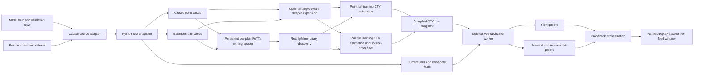

# Symbolic ProofRank Recommendation Architecture

**2026-09-10 runtime correction:** fixed-plan fpMiner discovery/support is now
exactly append-incremental through persistent plan AtomSpaces and
`IncrementalFpMinerCache`; unchanged plans issue zero miner queries. Mining is
bounded to the newest complete causal units (25,000 impressions/singletons and
250,000 cases by default). If an older unit expires, the retained workspace is
reconstructed and recounted exactly rather than approximately subtracting its
rules. Full causal feature reconstruction, full-training CTV recount/estimation
and validation, and staged PeTTaChainer compilation remain full-snapshot
operations. Live feedback reranks the unserved queue and cursors bind
`session:position:queue_revision`. Runtime behavior and measured evidence are
consolidated in this specification.

**2026-09-07 correction:** generated `PairSignal → PairWin` adapters now use
`(no_inverse pair_merge_rule_N)` proof names. They are one-way decision links;
allowing Bayesian inversion through their shared target could manufacture
evidence in another family. Earlier unwrapped adapter examples and benchmark
tables below describe the historical implementation. The complete 0.6810
model was reproduced, and the corrected bridge measured 0.6883 on the same
500 impressions. Dated regression notes were removed after their conclusions
were incorporated here.

**Document type:** implementation and mathematical specification

**System:** `recommendation/` live lab

**Reviewed against source:** runtime sections updated through 2026-09-10
**Primary dataset in the demonstration:** Microsoft MIND-small through the RecZoo projection

This document explains the system that is actually implemented: its data contract,
symbolic representations, mining workspaces, rule CTV estimation, PeTTaChainer truth
semantics, ranking formulas, live-feed lifecycle, benchmark, limitations, and
the configurable target-aware conjunction-expansion experiment, and the frozen
text-attention/proof-family development challenger.

It deliberately separates three statuses:

- **CURRENT** — implemented and active in the default lab.
- **EXPERIMENTAL** — implemented, configurable, but not the stable default.
- **PROPOSED** — an architectural change that is not implemented yet.

The distinction is important. The stable default remains support-driven fixed
combination mining. With `miner_strategy=target_aware`, however,
the active Lab invokes [`target_miner.py`](../../mining/target_miner.py) to perform
dataset-independent, one-predicate-at-a-time conjunction expansion with weighted
WRAcc and safe branch bounds. The real MeTTa fpMiner still discovers the unary
backoff layer; deeper target-aware patterns receive a full-training CTV recount, are compiled
into the same CTV snapshot and must produce PeTTaChainer proofs. Residual mining
and first-class PeTTa evidence groups remain proposed changes.

### Reading map

- [System boundaries and workspaces](#1-executive-model): sections 1–4
- [Data, facts and numeric symbols](#5-mind-ingestion-and-causal-feature-construction):
  sections 5–7
- [Mining and CTV estimation](#8-real-fpminer-layer): sections 8–12
- [PeTTa truth semantics and ProofRank](#13-petta-truth-value-mathematics-used-by-the-lab):
  sections 13–14
- [Live runtime, benchmark and controls](#15-live-runtime-and-infinite-feed-lifecycle):
  sections 15–18
- [Confirmed limitations](#19-known-semantic-and-statistical-limitations)
- [Target-aware search and successor design](#20-experimental-target-aware-symbolic-miner):
  sections 20–21
- [Worked example and analysis checklist](#22-worked-numerical-example):
  sections 22–25

---

## 1. Executive model

The core design principle is:

> **Pattern mining learns a bounded symbolic model from closed historical
> opportunities. PeTTaChainer applies that model to current candidate facts and
> returns proof-backed uncertain preferences. A deterministic orchestration layer
> converts those proofs into a ranked list.**

The stable default uses two related symbolic models:

1. A **pointwise model** estimates whether one candidate matches mined click
   conditions.
2. A **pairwise model** estimates whether the left candidate should outrank the
   right candidate, then aggregates pair proofs in a tournament.

The current default gives the pairwise tournament all fusion weight because the
verified MIND replay found it substantially more discriminative than the
pointwise layer. The pointwise layer remains an auditable comparator and a
possible fusion input.

The strongest observed development challenger additionally loads a frozen
title+abstract embedding sidecar, computes exact causal T=8 similarity attention,
lets fpMiner discover its directional pair rule, and averages the PeTTa-derived
text-family and structured-family ranks. Its public-validation AUC was 0.6810;
it is experimental, not the stable default, not an independent-test result, and
not a 0.70 or SOTA claim.



### What the engine is and is not

The lab is a real symbolic pipeline:

- It invokes a real MeTTa frequent-pattern miner.
- It compiles mined conditional rules into real PeTTaChainer rules.
- Non-neutral symbolic evidence enters ranking only through returned PeTTa
  proofs. A no-proof candidate remains at the base-rate/neutral pair signal
  before deterministic exact-tie ordering.
- There is no Python popularity recommender fallback.

It is not yet a production recommender:

- Candidate retrieval is a bounded corpus/impression adapter, not Mindplex
  production retrieval.
- The active lab exposes an on-demand, bounded, non-mutating semantic preview
  through [`engine.py`](../../integrations/engine.py). Stable-default ranking facts remain the
  deterministic MIND projection. The measured text-attention challenger adds a
  frozen title+abstract vector sidecar, but NL2PLN output is not yet
  batch-cached or used by either ranking profile.
- It has no durable model registry or deployed artifact format.
- Logged-slate replay does not establish counterfactual online quality.
- It cannot guarantee SOTA performance on an unseen distribution.

---

## 2. Source map and responsibility boundaries

| File | Responsibility |
|---|---|
| [`app/server.py`](../../app/server.py) | Orchestration, mining projections, rule CTV estimation, rule compilation, PeTTa worker lifecycle, scoring, feed, API, benchmark, comparison and tuning |
| [`evaluation/training_gate.py`](../../evaluation/training_gate.py) | Chronological whole-impression training split, causal confirmation-slate projection, paired raw-AUC decision, ephemeral worker cleanup and atomic staged promotion |
| [`adapters/mind.py`](../../adapters/mind.py) | MIND/RecZoo adapters, causal feature snapshots, sampling, entity vectors, lexical and transition evidence |
| [`core/multi_interest.py`](../../core/multi_interest.py) | Dataset-neutral history-relative semantic summaries, including exact causal text-vector attention |
| [`features/text_embeddings.py`](../../features/text_embeddings.py) | Offline title+abstract encoder sidecar builder and Torch-free verified NPZ loader |
| [`core/symbolic.py`](../../core/symbolic.py) | Frozen train-only quantile symbols for continuous evidence |
| [`mining/target_miner.py`](../../mining/target_miner.py) | Experimental target-aware conjunction expansion over bounded categorical rows; imported with the Lab module and invoked only when its strategy is `target_aware` |
| [`mining/petta_workspace.py`](../../mining/petta_workspace.py) | Persistent per-plan PeTTa AtomSpaces, stable case hashing, and append/reuse/rebuild synchronization |
| [`mining/incremental_fpminer.py`](../../mining/incremental_fpminer.py) | Exact append-incremental sufficient statistics obtained from the real MeTTa fpMiner; zero-query reuse and safe full rebuild fallback |
| [`miner/fpMiner.metta`](../../miner/fpMiner.metta) | Recommendation-local frequent-pattern enumeration and empirical STV formatting |
| [`miner/helpers.metta`](../../miner/helpers.metta) | Required target functor, connected exact-`k` combination generation, counting and confidence conversion |
| [`web/templates/index.html`](../../web/templates/index.html) | Live feed, infinite-scroll client, controls and benchmark display |
| [`integrations/engine.py`](../../integrations/engine.py) | Active HTTP boundary for bounded on-demand PeTTaChainer/NL2PLN article previews; future ingestion/cache boundary |
| [`PeTTaChainer/pettachainer/metta/tv_formulas.metta`](../../../PeTTaChainer/pettachainer/metta/tv_formulas.metta) | STV/CTV propagation and revision mathematics |
| [`PeTTaChainer/pettachainer/metta/chainer_utils.metta`](../../../PeTTaChainer/pettachainer/metta/chainer_utils.metta) | Proof scoring, evidence provenance and proof merging |

### Which PatternMiner is actually used

The live lab does **not** invoke
`Mindplex-Hyperon/experiments/pattern-miner/pattern-miner.metta`. That module is a
thin wrapper over a frequent miner. The lab loads the recommendation-local
[`helpers.metta`](../../miner/helpers.metta) and [`fpMiner.metta`](../../miner/fpMiner.metta)
into `PeTTa()` at [`app/server.py`](../../app/server.py), then directly calls
`frequency-pattern-miner` for point and pair workspaces.

It is therefore accurate to describe the current learner as a
**recommendation-local exact-`k` frequent miner**, not as a direct invocation of
the external wrapper or the current iCog recursive conjunction-expansion path.

The separate [`target_miner.py`](../../mining/target_miner.py) is also real executable code,
but it is not a second serving engine. It accepts symbolic row mappings, binary
targets, optional weights and optional folds; maintains vertical bitset covers;
expands one new predicate at a time; and returns weighted/raw contingency tables,
WRAcc, safe positive/negative bounds, fold diagnostics and search counters. It is
unit-tested by [`test_target_miner.py`](../../tests/unit/mining/test_target_miner.py) and integrated by
`Lab.mine()` behind `miner_strategy=target_aware`. The integration deliberately
keeps final full-training CTV estimation unchanged, so the controlled comparison isolates
search structure rather than silently changing both discovery and scoring.

### Embedded runtime versus the HTTP semantic client

There are two embedded symbolic roles in the active process tree:

1. The parent creates `PeTTa()` and invokes the real MeTTa
   `frequency-pattern-miner` against persistent, deterministic per-plan mining
   spaces; exact support state decides full, delta-only, or zero-query reuse.
2. A spawned worker creates `PeTTaChainer()`, loads compiled point/pair CTV and
   bridge rules, grounds serving facts, and answers proof queries.

The active Lab also constructs `PeTTaChainerClient` from [`engine.py`](../../integrations/engine.py).
`POST /api/semantic/preview` copies one article record under the Lab lock,
releases the lock, and checks a content/configuration-hash cache. On a miss it
sends the title/abstract through the separately deployed PeTTaChainer HTTP
service to NL2PLN; on a hit it returns the validated prior preview. The cache is
bounded to 32 MiB/512 entries with a one-hour TTL and an explicit deployment
version. The feed exposes this as **Parse semantics** and labels fresh versus
cached results. Preview mode does not mutate the knowledge base, miner, or
scorer. A miss is a real model/API call, not a local heuristic.

These are complementary paths, not duplicate reasoners:

- the embedded worker applies already-mined recommendation rules at ranking
  time;
- the HTTP stack translates raw language into typed symbolic article meaning.

Semantic parsing belongs primarily at ingestion, not inside every candidate
comparison. A production-safe path parses each article once, constrains the
result to a versioned bounded predicate schema, caches it by content hash plus
parser/schema version, retains source spans and parser provenance, and exposes
only facts whose extraction reliability has been measured on held-out labelled
text to mining and serving. This can add events, actors,
relations, claims, tone, stance, and story continuity. It does not replace
target-aware mining: the parser says what the text may mean; the miner determines
which meanings predict engagement; PeTTaChainer proves the grounded decision.

---

## 3. Canonical data contract

The MIND adapter is replaceable. The recommendation core expects this conceptual
contract:

| Structure | Required content | Invariant |
|---|---|---|
| `users` | Stable ID and preceding history or interests | State must be available before the candidate outcome |
| `articles` | Stable ID, title, topic and bounded content metadata | A feature keeps the same meaning in train, replay and live scoring |
| `events` | User, article, closed action, impression and pre-outcome context | Every candidate in an impression shares the same pre-outcome snapshot |
| `tests` | User, native candidate slate, relevant IDs, candidate contexts | Evaluation labels never enter mining or feature construction |
| optional models | Entity vectors, title IDF, transition table | Source-provided or train-fitted without evaluation labels; every fitted transform is frozen before replay |

The returned Python snapshot is the source of truth for the laboratory run. It
is not itself a persistent MeTTa knowledge base.

### What “dataset-agnostic” means here

The reasoning core is adapter-driven, not magically zero-configuration. MIND
and RecZoo code knows how their rows encode impressions, categories, entity
annotations and vectors. A different provider must map its fields to the
contract above and declare which optional capabilities it supplies. The core
then continues to enforce the portable invariants: stable IDs, bounded
predicates, pre-outcome state, closed opportunity labels, train-only transforms,
and identical fact meanings during discovery, replay and serving.

This separation prevents a MIND category ID from becoming engine logic. It does
not imply that every signal transfers unchanged. Taxonomy, entity-vector model,
language tokenizer and sequential evidence are adapter capabilities whose
quality must be revalidated on the new domain. A dataset without entity vectors,
for example, may omit those facts while still using the same miner, CTV compiler,
PeTTa proof graph, tournament and benchmark protocol.

### Stable identifiers

Source IDs are normalized by [`safe_metta_symbol`](../../adapters/mind.py). Already-safe
characters remain readable. When normalization changes an ID, a SHA-256 suffix
is appended, avoiding the collision that would result from punctuation removal
alone.

### Closed opportunity semantics

An event row means a candidate was part of a known impression and has a closed
label (`click` or `skip`). This is materially different from treating every
unseen corpus item as a negative.

For pair learning, only a positive and a negative from the **same impression**
form a preference. This avoids inventing comparisons across different users,
times or candidate-generation policies.

---

## 4. Three-workspace lifecycle

The phrase “three workspaces” describes logical responsibilities. Their actual
implementations are:

### 4.1 Source snapshot — Python

`users`, `articles`, `events`, `tests`, fixed vectors and fitted feature models
are stored in the `Lab.data` mapping. Historical outcomes are immutable during an
offline benchmark. Online feedback is additionally tracked in `_online_events`.

This snapshot contains ordinary Python records, not proof statements. In the
default adapter it includes ordered user histories, article title/category/
subcategory/entity metadata, closed training exposures with their exact
pre-outcome contexts, held-out impression slates and labels, train-frozen title
IDF statistics, article entity vectors, a subcategory-transition table and
sampling metadata.

### 4.2 Miner scratch — persistent per-plan PeTTa spaces

The current runtime no longer clears and repopulates one
`&recommendation_cases` space for every pass. `PeTTaWorkspaceCache` retains one
named PeTTa AtomSpace for each deterministic plan. The plan identity binds the
point/pair kind, ordered feature set, conjunction depth, sampling/case policy,
and schema version, so unlike plans cannot reuse one another's facts.

For a point pass, one row contributes bounded facts such as
`(topic point_case_42 "news")` and
`(long_affinity point_case_42 "high")`, plus exactly one target fact
`(engagement point_case_42 "click")` or `"skip"`. A pair row contributes
directional facts such as
`(pair_long_affinity pair_case_73 "left")`, where click means “the left item
wins.” These scratch rows have neither proof names nor STVs: fpMiner needs
categorical covers and counts, not serving proof objects.

Point case IDs retain the append-stable source-event index. Pair IDs hash the
source impression, left and right source-event indexes, and schema. Complete
case hashes let the workspace distinguish four transitions:

- `reused`: no case changed, so no facts are transmitted;
- `appended`: only new stable cases are sent;
- `rebuilt`: a case changed/disappeared or a prior write was dirty, so the full
  plan space is safely reconstructed; and
- `created`: the plan is new.

Persistent facts alone do not make repeated fpMiner calls incremental.
`IncrementalFpMinerCache` therefore retains exact support sufficient statistics
for each fixed plan. A first use, mutation rebuild, or plan-shape change invokes
the real MeTTa `frequency-pattern-miner` twice at support floor 1: once for the
click target and once for skip. For each premise `A`, it retains
`n(A and click)`, `n(A and skip)`, total clicks, and total cases. Support one is
lossless: every structure that can pass any later `min_support >= 1` necessarily
appeared in the seed.

For strict appends the same two fpMiner target queries inspect only a delta
AtomSpace and their counts are added to the prior counts. If nothing changed,
the cached plan renders the requested support threshold with zero fpMiner
queries and zero researched cases. Changed or removed cases force
`rebuilt_full`; feature/depth/target changes force `reconfigured_full`. The
state assignment occurs only after querying, parsing, merging, and validating
all counts, so a failed delta cannot partially commit support.

Before either point or pair mining, the event stream is reduced to one shared,
deterministic newest suffix of **complete causal units**. A source impression is
atomic; a closed event without an impression is an atomic singleton. The
default bounds are 25,000 units and 250,000 cases. The selector never splits an
impression, never skips a newer unit merely to fit an older one, and rejects a
snapshot when even the newest unit cannot fit the case bound. Its audit records
source/retained/expired units and cases, which limit bound the suffix, and a
SHA-256 digest of retained membership.

A strict append that does not expire a retained unit remains eligible for the
delta path. Once any prior unit expires, cached counts cannot be decremented
without signed per-unit provenance, so the implementation deliberately selects
`retention_expired_full`: it reconstructs the complete retained plan AtomSpace
and runs the two support-one target queries again. Point and pair discovery,
target-aware search, CTV recount and tie/popularity statistics all consume that
same retained snapshot. Expiration is therefore implemented and exact, although
it is more expensive than an append-only delta.

The equivalence to a full fixed-plan rerun follows from count additivity:

\[
n_{new}(A\land y)=n_{old}(A\land y)+n_{delta}(A\land y).
\]

The reconstructed discovery CTV is consequently identical. With
`a=n(A and click)`, `b=n(A and skip)`, `N` cases, `Y` total clicks, and evidence
constant `K`:

\[
s_+=\frac{a}{a+b},\quad c_+=\frac{a+b}{a+b+K},\quad
s_-=\frac{Y-a}{N-a-b},\quad c_-=\frac{N-a-b}{N-a-b+K}.
\]

This guarantee applies to fpMiner discovery/support for a fixed plan. The lab
still reconstructs current candidate features and the exhaustive CTV-estimation
population, runs any separate target-aware/conditional search, recounts and
re-estimates selected structures over the full causal impression population, validates and
selects rules, and compiles a fresh serving worker. Those full stages are
intentional and currently dominate background-build time.

With an experimental target-aware strategy, deeper expansion still operates on
equivalent bounded row mappings in Python memory; the real MeTTa fpMiner owns
the mandatory seed layer. Point search uses one unit per sampled exposure. Pair
mining remains hybrid: fpMiner support counts raw sampled oriented rows, while
deeper target-aware search can weight rows to total one per usable impression.
Every selected layer undergoes a full-training recount and CTV estimation before serving.

The support cache is fail-closed at 250,000 tracked support-one patterns per
plan, 512 cached plans per process, and 1,000,000 cases per plan. A new plan is
rejected before allocation when the plan bound is full; case and pattern
overflow reject the staged build before its transactional state assignment.
There is no silent pattern truncation or approximate continuation.

`MINER_LOCK` serializes PeTTa workspace mutation and fpMiner queries because
the named PeTTa/MeTTa bindings are process-global.

### 4.3 Serving proof graph — isolated process

The active rule snapshot lives in a dedicated spawned `PeTTaChainer` worker.
This is necessary because compiled PeTTa rule/index state is process-global even
when high-level KB IDs differ.

The worker receives selected point/pair rule statements with full-training CTV
estimates and their bridge rules (`Mined...` to the queried decision predicate).
Frozen Python rule metadata remains in the parent `Lab`; the worker does **not**
receive that metadata or the historical click/skip case table.
Candidate facts such as `(Topic candidate_x "news")` and pair-direction facts
are grounded lazily with named proof IDs as requests arrive. Thus the miner
workspace answers “which structures are supported?”, whereas the serving
workspace answers “what follows for this grounded candidate under the compiled
model?”

Weighted point scoring does not ask one crowded shared `Engagement` goal to
enumerate every applicable mined rule. That earlier query shape was bounded by
a shared search budget: it could return a valid revision representative before
visiting all applicable rules, so a direct all-rule reconstruction differed for
search-completeness reasons rather than because the rule/STV semantics differed.
Each compiled point rule now also owns an isolated `PointSignal` channel. The
host performs only the exact categorical applicability join, PeTTaChainer proves
each active isolated root, and a missing expected root fails closed. The legacy
shared `Engagement` revision goal remains only for aggregation modes that
explicitly request PeTTa's merged max/hybrid result.

Worker recovery state is bounded as well. Since the last atomic rule replacement,
the parent journals at most 50,000 acknowledged mutations containing at most
250,000 statements. A mutation that would cross either limit is rejected before
it reaches the worker and requires a fresh snapshot promotion. Candidate-fact,
point-case/channel, pair-case/channel and pair-margin result caches are each
guarded by the configured `max_proof_cache_entries` value (250,000 by default;
hard configuration ceiling 1,000,000). Cache overflow likewise fails the request
before mutation or insertion; it never evicts evidence silently or changes to a
fallback ranking model.

On remine:

1. The lab retains its current worker and metadata.
2. It mines and compiles a complete point-plus-pair rule snapshot.
3. A new worker starts and loads the complete snapshot.
4. Only after successful startup does the new worker replace the old worker.
5. Ground candidate/pair facts are then loaded lazily.

A failed mining or compilation pass restores the old metadata and leaves the old
worker active. See [`IsolatedPeTTaChainer`](../../app/server.py) and
[`Lab.mine`](../../app/server.py).

### 4.4 Explicit example: the contents are different

Consider the real retained training impression `164` for `U70158`. It contains
13 exposed candidates: `N2476` was clicked and the other 12 were skipped. The
Python source snapshot retains both article metadata and the causal context that
existed before any outcome in that slate. For `N2476`, a shortened record is:

```python
{
    "article": "article_N2476",
    "action": "click",
    "impression": "impression_train_164",
    "topic": "sports",
    "subcategory": "football_nfl",
    "long_affinity": "medium",
    "recent_affinity": "medium",
    "subcategory_affinity": "low",
    "topic_affinity": 0.2,
    "entity_recent_top1_similarity": 0.62468526,
    "recent_subcategory_transition_score": 0.19483004,
}
```

The point miner does not receive that Python dictionary or its article ID as
one opaque fact. It receives a bounded row such as:

```metta
(topic case_0 "sports")
(recent_affinity case_0 "medium")
(long_affinity case_0 "medium")
(entity_overlap_detail case_0 "one")
(history_topic_count_bucket case_0 "three_plus")
(recent_topic_count_bucket case_0 "one")
(engagement case_0 "click")
```

`case_0` is only a row key. The semantic values remain visible as `"sports"`,
`"medium"`, and `"one"`. This directly answers a common source of confusion:
`(by mined_26 fact_candidate_..._topic)` is proof provenance saying *which rule
used which named fact*. The actual serving fact still contains the value:

```metta
(: fact_candidate_87733fde81eee50013cc_topic
   (Topic candidate_87733fde81eee50013cc "sports")
   (STV 1.0 1.0))
```

For a clicked-versus-skipped comparison, the pair miner receives directional
facts rather than two point rows. A shortened example is:

```metta
(pair_long_affinity pair_case_0 "left")
(pair_subcategory_affinity pair_case_0 "left")
(pair_title_overlap pair_case_0 "right")
(pair_entity_recent_top1_similarity pair_case_0 "left_known")
(pair_recent_subcategory_transition pair_case_0 "left")
(pair_same_topic pair_case_0 "different")
(pair_same_subcategory pair_case_0 "different")
(engagement pair_case_0 "click")
```

The reverse orientation is also added with `left/right` swapped and target
`"skip"`. These scratch facts have no names, proof wrappers, STVs, or CTVs;
fpMiner needs covers and counts.

A learned structure then receives its full-training CTV estimate and is compiled, for example:

```metta
(: pair_mined_cluster_1_v1
   (Implication
      (Pair_Recent_Subcategory_Transition $pair "left")
      (MinedPairPreference $pair "pair_mined_cluster_1"))
   (CTV
      (STV 0.6075051 0.9443275)
      (STV 0.4000982 0.9816333)))
```

The serving worker receives that rule plus a lazy grounded fact for the current
pair, and PeTTaChainer answers a query such as:

```metta
(: $proof
   (PairSignal pair_candidate_5393faa8539a38027f49
               "pair_mined_cluster_1")
   $tv)
```

Historical `case_*` rows are never copied into the serving graph. In one line:

```text
Python snapshot = source/history/context records
miner scratch   = bounded historical feature rows + closed target
serving graph   = frozen compiled rules + current lazy facts + proof queries
```

---

## 5. MIND ingestion and causal feature construction

### 5.1 Default bounded replay

The default CLI loads `recommendation/dataset/MIND_small_x1.zip`, keeps at most
20,000 training exposures and 500 complete validation impressions, and uses seed
7. The RecZoo loader still scans the complete 5,843,444 training candidate rows
and 2,740,998 validation candidate rows.

A “candidate row” is one article exposure inside one logged impression; it is
not one user and not one article. In the bundled projection those rows form
156,965 training impressions and 73,152 validation impressions. With the default
limits and seed, the verified cache materializes 19,996 training exposures in
549 whole impressions (the bound may underfill because an impression is never
split) and 500 complete validation impressions containing 18,139 candidates and
789 positives. It loads 11,142 referenced articles and 1,042 users. These are
sample/cache facts, not the full MIND population and not a statement that only
those users or articles exist in the archive.

Precisely, an **impression** is one logged recommendation opportunity: one user,
at one time/context, was shown one ordered candidate slate. Every candidate in
the slate shares the same pre-impression history, and every exposed candidate
has a closed binary outcome:

```text
impression_id, user_id, time, preceding_history,
    [article_1:0, article_2:1, article_3:0, ...]
```

`1` means clicked. `0` means shown but not clicked; it does **not** mean every
unshown corpus article is a negative. The same user can have many impressions,
the same article can occur in many impressions, and one impression can contain
multiple clicks. An impression is therefore not an article, user, whole user
session, candidate row, or all possible retrieval candidates.

RecZoo denormalizes the slate to one CSV row per candidate. All contiguous rows
with one `imp_id` form one impression and must share one user and one preceding
history. Pair mining compares a click with a skip only inside that group. AUC is
also computed inside each eligible impression and then macro-averaged, so a
small and large slate receive equal outer weight. A live ID of the form
`live_<session>_<start>_<end>` is an analogous feed opportunity created by this
application; it is not a native historical MIND impression.

For the RecZoo archive, a SHA-256 priority over `(seed, split, impression_id)`
selects complete impressions. Selected impressions are restored to source order.
The bound limits materialized cases, not the source scan.

Generated gzip replay caches are keyed by adapter version, source path, size,
mtime, bounds and seed.

### 5.2 Prequential anti-leakage rule

For every training impression:

1. Read the user history and counters as they existed before the impression.
2. Compute candidate contexts for every candidate from that shared snapshot.
3. Only after all contexts are captured, update exposure/click/transition
   counters with the impression outcomes.

This prevents one candidate’s click from becoming another candidate’s feature in
the same impression. Validation uses models frozen after the complete training
scan. The relevant RecZoo implementation is in [`adapters/mind.py`](../../adapters/mind.py).

Concretely, if articles A and B appear together and A is clicked, B's feature
row must not suddenly include A in the user's history or the just-observed click
in A/B CTR and transition counters. Both rows describe the information that was
available when the slate was shown. Only after both snapshots exist may the
state advance. Sampled-away training impressions still advance the source-order
priors, while retained impressions supply mining cases. Validation starts from
its logged history but uses transforms and aggregate models frozen after the
training scan.

Here “causal snapshot” means time-valid, label-leakage-safe feature construction.
It does not estimate the causal effect of recommending an article, and it does
not remove the historical logging policy's exposure or position bias.

### 5.3 Adapter difference that matters

The default RecZoo path preserves whole training impressions under its bound.
The alternative extracted raw-MIND loader uses row-level reservoir sampling for
bounded training events in [`adapters/mind.py`](../../adapters/mind.py), so that path can
fragment a training impression. It also currently returns no entity-vector or
transition model. Whole-impression training preservation must therefore be
treated as a property of the default RecZoo adapter, not a universal property of
every loader path.

### 5.4 Categorical feature formulas

Let `H` be the known preceding history, `H5` its last five positions, `t(x)` the
topic of item `x`, and `sc(x)` its subcategory.

| Feature | CURRENT definition |
|---|---|
| `format` | title words `<=7`: short; `8..14`: medium; `>=15`: long |
| `affinity` | high iff candidate topic appears in `H`, otherwise low |
| `topic_affinity` | `count(t(candidate), H) / |H|`, or `0` for empty history |
| `recent_topic_affinity` | `count(t(candidate), H5) / |H5|`, or `0` |
| `affinity_level`, `long_affinity` | none if count 0; low if share `<0.10`; medium if `<0.30`; high otherwise |
| `recent_affinity` | the same thresholds over `H5` |
| `history_size_bucket` | cold `0`; light `1..5`; regular `6..20`; heavy `21+` |
| topic count buckets | zero, one, two, three_plus over full/recent history |
| `topic_rank_bucket` | none if absent; top if tied for maximal topic count; otherwise secondary |
| `subcategory_affinity` | the same share thresholds over candidate subcategory in `H` |
| `recent_subcategory_affinity_score` | share of the raw last-up-to-five history positions whose known subcategory equals the candidate subcategory |
| `topic_recency_score` | `1/(1+d)` where `d=0` is the most recent known matching topic position; `0` when no match; unavailable when candidate topic is missing |
| `subcategory_recency_score` | the analogous inverse distance for candidate subcategory |
| topic/subcategory recency buckets | none if no match; immediate for `d=0`; recent for `d=1..4`; older for `d>=5`; unknown when candidate metadata is missing |
| `entity_overlap` | none `0`; low `1`; high `2+` shared entity IDs |
| `entity_overlap_detail` | none, one, two, three_plus |
| `title_overlap_detail` | count bucket for candidate tokens intersecting the union of history-title tokens |
| `time_bucket` | night `00..05`; morning `06..11`; afternoon `12..17`; evening `18..23` |
| `position_bucket` | top `0..1`; early `2..4`; middle `5..9`; late `10+` |
| `ctr_bucket` | cold if no prior exposures; otherwise low `<.05`, medium `<.20`, high `>=.20` using Beta-smoothed CTR |
| `freshness_bucket` | new if no prior exposure; recent if first seen within 1,000 prior exposure positions; otherwise established |

CTR smoothing is:

\[
\widehat{CTR}(i)=\frac{clicks_i+1}{exposures_i+10},
\]

which corresponds to a Beta(1,9) prior. These formulas are implemented in
[`adapters/mind.py`](../../adapters/mind.py).

### 5.5 Lexical semantic evidence

Titles are case-folded, tokenized, stripped of a small fixed stopword list, and
only tokens longer than two characters remain.

For `D` unique articles exposed in training and document frequency `df(t)`, the
smoothed token weight is:

\[
idf(t)=\ln\left(\frac{D+1}{df(t)+1}\right)+1.
\]

An unseen token receives `ln(D+1)+1`. Repeated exposure of a popular item does
not change document frequency because each exposed article contributes once.

For candidate token set `C` and one historical title token set `J`:

\[
Jaccard_{idf}(C,J)=
\frac{\sum_{t\in C\cap J}idf(t)}
     {\sum_{t\in C\cup J}idf(t)}.
\]

`title_history_idf_jaccard` is the maximum value over usable historical items.
Missing comparable text yields no value; valid disjoint text yields `0.0`.

This is lexical overlap, not full natural-language understanding. The adapter
reads title and abstract fields plus source-supplied title/abstract entity
annotations, but this lexical scorer analyzes **titles only**. It does not
embed the raw abstract or infer relations from sentences. Section 5.5.2
documents the separate frozen title+abstract vector challenger. The on-demand
preview calls NL2PLN, but its returned statements are not yet batch-projected
into ranking facts. The entity annotations can still reflect abstract entities
because they were already supplied by MIND/RecZoo; that is metadata consumption
rather than new text parsing by the ranking model.

#### 5.5.1 What NL2PLN adds, and what it does not

Yes, the recommender can benefit from NL2PLN because it can expose information
that category IDs and token overlap cannot express. The live preview currently
uses this bounded schema:

```text
HasTopic(article, normalized_topic)
MentionsActor(article, person_team_organization_or_place)
DescribesEvent(article, normalized_event_type, principal_actor)
HasTone(article, normalized_tone)
ExpressesStance(article, target_or_proposition, normalized_stance)
AboutStory(article, normalized_continuing_story)
```

A verified real call for a MIND article about the Astros produced ten statements,
including `HasTopic(... baseball_world_series)`, actors `Astros`,
`Justin_Verlander`, `Jose_Altuve`, and `Washington`, the events `team_meeting`
and `game_loss`, tone `encouraging`, a positive stance, and continuing-story
identity `world_series_comeback`. This was returned by the configured
PeTTaChainer → NL2PLN → model-provider path, not inferred by
`adapters/mind.py`.

Raw high-cardinality names should not be dumped directly into fpMiner. The
portable ingestion projection is history-relative and bounded, for example:

```text
actor_affinity       = none | low | medium | high
event_type_affinity  = none | low | medium | high
story_continuity     = new | followup | same_event
stance_match         = agree | disagree | unknown
typed_relation_overlap = none | one | two | three_plus
semantic_novelty     = low | medium | high
```

The division of responsibility is:

```text
NL2PLN        : what does this article assert or describe?
adapter       : how does that meaning relate to this user's preceding history?
PatternMiner  : which bounded relations predict the closed engagement target?
PeTTaChainer  : what ranking preference follows for this grounded candidate?
```

NL2PLN is neuro-symbolic ingestion—it uses a configured language model—but it is
not a hidden neural click scorer. It never directly supplies `P(click)`. Each
immutable article should be parsed once and cached by content hash, model,
prompt, ontology, and schema versions. At a 30-request/minute limit, 11,142
articles would have a theoretical one-at-a-time minimum of about 371 minutes
before model latency and retries, so bulk integration needs a durable offline
cache rather than ranking-time calls.

The emitted `(STV 1 1)` means the translated text asserts that fact without an
explicit hedge under the parser's current contract; it is not a measured parser
accuracy of 100%. Production ingestion must retain model/version/source-span
provenance and calibrate extraction reliability separately on held-out labelled
text.

#### 5.5.2 Frozen text sidecar and exact causal attention

The implemented text-vector path is deliberately split into offline ingestion
and symbolic recommendation:

```text
normalized title + "\n\n" + abstract
  -> pinned sentence encoder, once per immutable article
  -> L2-normalized float32 NPZ with content/model/vector provenance
  -> candidate-relative causal history statistic
  -> bounded left/right pair fact
  -> fpMiner discovery -> full-training CTV estimate -> PeTTa proof
```

`features/text_embeddings.py` imports `sentence_transformers` only when building. Its
NPZ loader validates IDs, dimensions, finite unit vectors, metadata and the
vector checksum using NumPy alone; the ranking process does not load Torch. The
text recipe uses Unicode NFKC normalization, whitespace folding, the title,
then an optional blank line and abstract. The encoder receives no user ID,
impression position, exposure, click or evaluation label.

Let \(v\) be the L2-unit candidate vector and
\(h_1,\ldots,h_m\) every dimension-compatible L2-unit vector in the user's
history as it existed before the impression. Define raw cosine and mapped
similarity:

\[
c_i=\operatorname{clip}(v^T h_i,-1,1),
\qquad s_i=\frac{c_i+1}{2}.
\]

For temperature \(T>0\), exact candidate-aware softmax attention is:

\[
c_{max}=\max_j c_j,
\qquad
\alpha_i(T)=
\frac{\exp(T(c_i-c_{max}))}
     {\sum_j\exp(T(c_j-c_{max}))},
\]

\[
A_T(v,H)=\sum_i\alpha_i(T)s_i.
\]

The max subtraction is numerical stabilization only and leaves the normalized
weights unchanged. Crucially, the exponent uses **raw cosine** \(c_i\); only
the weighted output uses mapped similarity \(s_i\in[0,1]\). The current builder
emits `text_semantic_attention_t8_similarity` and the T=12 ablation, rounded to
eight decimals. Availability and coverage facts distinguish missing vectors;
the numeric value is bounded to `[0,1]`. Training rows use their exact
pre-impression history, and validation/live rows use only history available at
their scoring time. The attention is therefore candidate-aware and causal, not
a batch artifact and not a learned click model.

The pair projection compares two \(A_T\) values and emits
`pair_text_semantic_attention_t8 = left | right | equal | left_known |
right_known | unknown`. PatternMiner sees only that bounded symbolic relation.
The sentence encoder supplies semantic evidence, but it neither selects the
recommendation rule nor directly supplies a probability of engagement.

The recorded sidecar contains 11,142 vectors of dimension 384 with:

| Provenance field | Recorded value |
|---|---|
| model | `sentence-transformers/all-MiniLM-L6-v2` |
| pinned/resolved revision | `1110a243fdf4706b3f48f1d95db1a4f5529b4d41` |
| normalization/dtype | L2-unit / `float32` |
| content SHA-256 | `9c7491620f07bea52c4c51a10b4b6f1a2dfd26123f8b219c1a321c8894a16df8` |
| vector SHA-256 | `e57f0f7199252380e6739af0931d45e1df95c42669c9b662e2a88761bc1c763e` |

This vector path and NL2PLN solve different ingestion problems. The sidecar
provides dense semantic proximity now; NL2PLN can later provide explicit
actors, events, relations, stance and story continuity after those outputs have
a versioned offline cache and bounded history-relative projection.

### 5.6 Entity-embedding evidence: not a fitted neural recommender

The RecZoo archive contains a fixed Microsoft 100-dimensional entity embedding
matrix. The lab does not train, fine-tune or backpropagate through it.

For an article with entity vectors `e_1 ... e_m`:

\[
v_{article}=\frac{\frac{1}{m}\sum_j e_j}
                  {\left\|\frac{1}{m}\sum_j e_j\right\|_2}.
\]

Candidate/history similarity is ordinary cosine similarity, clamped to
`[-1,1]`:

\[
cos(v_a,v_h)=\frac{v_a\cdot v_h}{\|v_a\|_2\|v_h\|_2}.
\]

Two scalar facts are derived:

- `entity_recent_top1_similarity`: maximum cosine over the last five history
  positions with known vectors.
- `entity_long_mean_similarity`: mean cosine over all known history vectors.

A missing vector produces missing evidence, not a fabricated zero. See
[`adapters/mind.py`](../../adapters/mind.py).

The vectors are learned upstream metadata, so using them is not training a neural
network in this repository. They supply a continuous semantic measurement that
is quantized into bounded symbolic states before mining. Useful, still-symbolic
extensions include multiple recency-weighted interest prototypes, separate
max/mean/top-k similarities, abstract or sentence embeddings cached at
ingestion, and train-only supervised cut candidates. Each must preserve the
numeric value or train-fitted bucket as evidence; cosine similarity should not be
misrepresented as the truth strength of an unrelated proposition such as
`Topic(candidate,"news")`.

### 5.7 Recent subcategory-transition evidence

Let `C/E` be global training clicks/exposures. The frozen hierarchical estimates
are:

\[
g=\frac{C}{E},
\]

\[
p_c=\frac{C_c+20g}{E_c+20},
\]

\[
p_{h,c}=\frac{C_{h,c}+10p_c}{E_{h,c}+10}.
\]

Here `c` is the candidate subcategory and `h` is a recent history subcategory.
The candidate feature is the maximum of `p_c` and the available `p_{h,c}` values
for unique subcategories in the last five history positions.

For retained training rows the estimate is prequential; validation and live
serving use the complete frozen training table. This is a numeric premise, not a
hard-coded recommendation. The miner still has to discover whether its direction
predicts the target.

Unlike topic/title/entity metadata, this is a hand-engineered,
target-derived feature: its counters use prior click labels. Its legitimacy
depends on the impression-level prequential update above and on freezing the
training table before evaluation; without that ordering it would leak outcomes.

Intuitively, this feature asks: “after the kinds of subcategories appearing in
the user's last five reads, how often did this candidate subcategory receive a
click in prior training traffic?” The hierarchy backs a sparse transition
`h -> c` toward candidate-subcategory behavior and then toward the global rate.
The maximum lets the strongest recent state contribute. Plausible challengers
include time decay, ordered/session-specific transitions, signed lift over the
base rate, confidence/mass symbols and target-aware thresholds; they require
train-only fitting and an untouched evaluation gate.

### 5.8 Which formulas are research families and how they may be optimized

IDF weighting, Jaccard/cosine similarity, Beta-style smoothing, hierarchical
backoff and prequential evaluation are established technique families. The
particular title-length cuts, affinity thresholds, last-five window, smoothing
constants and bucket boundaries in this prototype are engineering choices, not
universal constants or a claim that a paper proved these exact values optimal.

Safe optimization changes the architecture at the training boundary rather than
peeking at validation labels. Candidate thresholds or parser predicates can be
proposed on inner training folds, constrained by minimum effective mass and
bounded cardinality, frozen in model metadata, and then assessed on later folds
and one untouched outer cohort. The target-aware strategy can rank bounded
symbolic states by weighted WRAcc, although it does not yet propose new numeric
thresholds itself. A semantic parser should likewise enrich articles once at
ingestion and emit a bounded, versioned schema; calling a changing remote model
inside replay or live pair scoring would break reproducibility and latency.

---

## 6. Symbolic representations and why IDs are not semantics

The same semantic observation has separate mining and serving projections.

### 6.1 Point case

Mining scratch facts contain no proof wrapper or TV:

```metta
(topic case_42 "news")
(long_affinity case_42 "high")
(engagement case_42 "click")
```

The serving fact is a named, certain PeTTa statement:

```metta
(: fact_candidate_a1b2_topic
   (Topic candidate_a1b2 "news")
   (STV 1.0 1.0))
```

### 6.2 Pair case

```metta
(pair_long_affinity pair_case_73 "left")
(pair_same_topic pair_case_73 "different")
(engagement pair_case_73 "click") ; click means left wins
```

Serving form:

```metta
(: fact_pair_candidate_c3d4_pair_long_affinity
   (Pair_Long_Affinity pair_candidate_c3d4 "left")
   (STV 1.0 1.0))
```

`fact_...` is a statement/proof name. `candidate_...` and
`pair_candidate_...` are grounding keys. The semantic predicate and value—such
as `Topic ... "news"` or `Pair_Long_Affinity ... "left"`—remain explicit.

Many articles can intentionally reuse one candidate grounding when their active
symbolic fact vectors are identical. Pair groundings go further and hash the
active rule-premise activation vector. This pooling reduces duplicate PeTTa
queries and is scoring-exact for the active rule set. A pooled pair case is not
a lossless, one-to-one audit record of every original pair's nonactivating
metadata; the first stored bounded attribute vector represents all pairs sharing
that activation signature.

### 6.3 Why grounded deterministic facts use `(STV 1.0 1.0)`

The fact TV answers whether the encoded observation is true, not whether the
article will be clicked. If the deterministic adapter calculated the candidate
topic as `news`, then `(Topic candidate_x "news")` is a crisp observed fact and
`(STV 1,1)` is appropriate. Predictive uncertainty belongs in the mined CTV
(`P(click | Topic=news, ...)`) and in the propagated proof, not by weakening the
input merely because topic alone is an imperfect recommender.

Uncertain semantic-parser output is different. A proposition inferred from text
may use a strength calibrated on held-out extraction labels for estimated truth
and a confidence derived from
validated evidence or an explicit effective count. A model's raw self-reported
“confidence” must not be copied blindly into PeTTa confidence, because PeTTa
decodes confidence through `n=800c/(1-c)`. Fuzzy membership such as “mostly
about finance” also needs a declared ontology and held-out calibration policy.
Numeric
measurements such as cosine similarity should normally remain values that are
quantized into predicates; they are not automatically proposition truth
probabilities.

---

## 7. Frozen numeric symbolic lattice

Raw continuous values are not sent directly into fpMiner because unconstrained
float values would create a high-cardinality vocabulary.

On every remine, [`QuantileNumericEvidence`](../../core/symbolic.py) is fitted for
all five registered numeric sources using training scalars and training
positive-vs-negative pair deltas. The active profile later decides which fitted
encoders are consumed.

### 7.1 Threshold selection

For `B` requested bins, sort finite training values. Each ideal quantile boundary
`q|S|/B` is moved to the nearest split between distinct observations; exact ties
prefer the lower split. Duplicate selected boundaries collapse, so the effective
bin count can be less than requested.

Scalar value `x` is encoded as:

\[
q(x)=1+\operatorname{bisect\_right}(thresholds,x),
\]

and emitted as `q1 ... qN`.

### 7.2 Directional delta symbols

For a complete pair `(L,R)`, magnitude is `|L-R|`. The magnitude quantile keeps
direction:

```text
left_q1 ... left_qN
right_q1 ... right_qN
```

The equality test is:

```text
isclose(L, R,
        relative_tolerance = 1e-12,
        absolute_tolerance = 1e-12 × training_range)
```

Explicit incomplete states are `unknown`, `left_known`, and `right_known`.
Swapping a complete pair produces the exact opposite direction with the same
magnitude bin.

That scale-relative absolute tolerance belongs to the quantile encoder. Coarse
numeric left/right comparisons in Lab use fixed relative and absolute
tolerances of \(10^{-12}\), so the two encodings can differ at extremely small
dataset scales.

The lab fits encoders for full/recent topic share, subcategory share, recent
entity similarity and transition score in [`app/server.py`](../../app/server.py). The
stable default uses coarse entity/transition direction; quantized variants are
available in experimental pair profiles.

---

## 8. Real fpMiner layer

### 8.1 What `depth` means

`engagement` is a required functor. Therefore:

- depth `2` = one premise plus outcome;
- depth `3` = two premises plus outcome;
- depth `4` = three premises plus outcome.

### 8.2 Search procedure

For a loaded scratch space, the current miner:

1. Enumerates each observed `(predicate, value)` whose marginal support reaches
   `minsup`.
2. Creates fixed-size combinations that share one case hub.
3. Forbids duplicate functors and unintended shared secondary placeholders.
4. Requires the `engagement` functor in every combination.
5. Counts joint support and retains combinations reaching `minsup`.
6. Moves engagement to the end and emits `supportOf` with an empirical STV.

For antecedent `A` and target `Y`:

\[
s=\frac{n(A\land Y)}{n(A)}, \qquad
c=\frac{n(A)}{n(A)+800}.
\]

Example output shape:

```metta
(supportOf
  ((, (long_affinity $x "high")
      (engagement $x "click"))
   (STV 0.61 0.93))
  4200)
```

The parser keeps positive target forms and later re-estimates their structures on full training data.

### 8.3 Important classification

By itself this is **positive-target-constrained frequent mining**, not native
discriminative target-aware search.

The target is structurally required, but:

- value pruning is based on marginal support;
- conjunction pruning is based on joint support;
- click-vs-skip contrast does not guide branch expansion;
- WRAcc, growth rate and an AUC bound are not computed in fpMiner;
- Python filters target quality and estimates serving CTVs only after discovery.

Consequently, increasing `min_support` or conjunction depth does not make the
search target-aware. A rare, discriminative value can be removed before its
target contrast is measured.

Under `fixed_combinations`, fpMiner performs unary and whitelisted deeper
discovery exactly as above. Under `target_aware`, it always performs the real
unary pass; the Lab then uses the bounded target-aware search in section 20 for
deeper structures. This hybrid retains a directly auditable MeTTa backoff layer
while testing target-conditioned conjunction expansion.

### 8.4 Exact text-attention rule in the measured artifact

The T=8 development workspace adds ordinary closed scratch rows such as:

```metta
(pair_text_semantic_attention_t8 pair_case_42 "left")
(engagement pair_case_42 "click")
```

and its mirrored right/skip orientation. There is no hard-coded semantic
recommendation. The same real `frequency-pattern-miner` invocation used by the
other pair features discovered:

```text
pair_text_semantic_attention_t8="left" -> engagement="click"
```

The sampled joint support was 4,081. A full-training recount over all eligible retained
oriented pairs measured antecedent support 40,510 and left-win joint support
25,939, hence positive strength `0.6403110343125155`. The selected rule was
compiled as:

```metta
(: pair_mined_cluster_1_v1
   (Implication
      (Pair_Text_Semantic_Attention_T8 $pair "left")
      (MinedPairPreference $pair "pair_mined_cluster_1"))
   (CTV
      (STV 0.6403110343125155 0.9631589918002136)
      (STV 0.3646021915197713 0.981299672744273)))
```

The serving graph then applies the ordinary identity decision hop and queries
`PairSignal(pair,"pair_mined_cluster_1")`. Thus the encoder supplies one input
measurement, fpMiner selects the predictive symbolic relation, full-training
CTV estimation supplies its rule value, and PeTTaChainer supplies the returned proof/STV.

---

## 9. Pointwise learning and scoring

### 9.1 Discovery sampling

Point discovery groups events by impression, keeps every positive, and samples
up to `negative_ratio` skips per positive from that impression. The default is
four. Negative-only impressions contribute no discovery rows.

Sampling is only a structure-search optimization. Every discovered rule is
recounted and CTV-estimated against **all** retained training events before compilation.
During fixed-combination discovery, `min_support` applies both to marginal
feature atoms and to the full target-containing pattern's joint count
\(n(A\land click)\). In target-aware expansion it applies to antecedent weight
mass; target quality is WRAcc and final click statistics are re-estimated later.
Point CTV estimation does not reapply it as an antecedent-support threshold.

The recommendation-local MeTTa formatter now attaches a discovery CTV to each
target pattern. This is an adaptation of the CTV idea merged in
`Mindplex-Hyperon`, not a direct import. Its contingency contract is:

- `N` is the number of distinct closed case IDs carrying an engagement label,
  never `db_size`/the number of feature atoms;
- `nY` counts distinct cases with the explicitly requested target value;
- `nA` counts cases matching the target-free antecedent;
- `nAY` counts the antecedent joined to exactly that target; and
- invalid or target-mismatched tables emit no rule.

This fixes two defects that would otherwise make CTVs depend on schema width
and could label an `(engagement ... "skip")` conjunction as evidence for a
requested `"click"` target. `parse_rules` preserves both native branches as
`discovery_ctv`, but the sampled CTV is never compiled into serving. The full
full-training CTV estimation below remains authoritative.

### 9.2 Vocabulary and depth plan

For the selected point feature profile, values are ranked by marginal
frequency. Up to `max_feature_values` values reaching `min_support` are kept
explicitly. If any values are not kept, all of them—including infrequent
values—are pooled into `other`; therefore a predicate can expose up to
`max_feature_values + 1` symbols. A predicate is omitted only when no value
reaches minimum support.

The stable default point profile is `accuracy_detail`:

```text
topic
recent_affinity
long_affinity
entity_overlap
entity_overlap_detail
history_topic_count_bucket
recent_topic_count_bucket
```

Depth two mines every available unary premise through fpMiner. With
`fixed_combinations`, higher depths use explicit whitelists in
[`INTERACTION_PAIRS` and `INTERACTION_TRIPLES`](../../app/server.py).
With `target_aware`, the target is kept outside the antecedent and canonical
one-predicate expansion considers every active bounded predicate; only
two-premise or deeper antecedents are added because fpMiner owns the unary layer.

### 9.3 Full-training CTV estimation

Define:

- `N`: all retained training events;
- `N+`: all positive events;
- `p0=N+/N`: training click base rate;
- `A`: one discovered antecedent;
- `nA`: events matching `A`;
- `nA+`: positive events matching `A`;
- `d`: number of premise predicates.

The positive branch is:

\[
s_+=P(Y\mid A)=\frac{n_{A+}}{n_A},
\]

\[
c_+=\frac{n_A}{n_A+K_{input}}.
\]

The outside branch is:

\[
s_-=P(Y\mid \neg A)=\frac{N_+-n_{A+}}{N-n_A},
\]

\[
c_-=\frac{N-n_A}{N-n_A+K_{input}}.
\]

Additional metadata:

\[
lift=\frac{s_+}{p_0},
\]

\[
Q_{point}=c_+\,|s_+-p_0|\,
             \left(1+0.25(d-1)\right)\ln(1+n_A).
\]

The absolute deviation allows both positive- and negative-lift click rules to
carry ranking information. Point rules currently have no ordered-fold
stability filter.

The default is `K_input=800`. The implementation guards empty denominators: a missing antecedent or empty
outside population produces strength/confidence zero, and lift is zero when the
base rate is zero.

Rules sort by `Q_point` by default. If the rule count exceeds 30, the selector
first reserves a quota for every mined specificity and then fills the remainder
by global quality. See [`Lab._mine_once`](../../app/server.py).

### 9.4 Compiled point rule

```metta
(: mined_26
   (Implication
      (Topic $case "news")
      (Engagement $case "click"))
   (CTV
      (STV s_positive c_positive)
      (STV s_outside c_outside)))
```

Serving asks:

```metta
(: $proof (Engagement candidate_a1b2 "click") $tv)
```

A simple returned proof can have the form:

```metta
(: (by mined_26 fact_candidate_a1b2_topic)
   (Engagement candidate_a1b2 "click")
   (STV s c))
```

### 9.5 Point posterior and aggregation

Given PeTTa proof STV `(s,c)` and empirical click prior `p0`, the decision
posterior is shrunk toward the prior:

\[
p=p_0+c(s-p_0).
\]

This is not `s*c`: zero confidence returns the base rate, and a negative-lift
proof can rank below the base rate.

The point aggregation modes are:

#### `max`

Choose the PeTTa root proof maximizing `p0+c(s-p0)` and use its inferred STV.

#### `weighted` — CURRENT default

PeTTa proves which rule IDs fired. Python then combines the stored CTV-estimated
rule metadata. For fired rule `r`, let weight `w_r` equal its specificity:

\[
c_*=\frac{\sum_r w_rc_r}{\sum_r w_r},
\]

\[
p_*=\frac{\sum_r w_r[p_0+c_r(s_r-p_0)]}{\sum_r w_r}.
\]

The displayed decision strength is reconstructed as:

\[
s_*=p_0+\frac{p_*-p_0}{c_*}
\]

when `c_*>0`, then clips reconstructed strength to \([0,1]\). The API exposes
this constructed `stv` and separately exposes the actual PeTTa root as
`inference_stv`.

This means the default point score is accurately described as
**PeTTa-proof-gated CTV-estimate aggregation**, not PeTTa’s canonical revision
output alone.

#### `hybrid`

Blend 80% proof-gated CTV-estimate aggregation with 20% canonical PeTTa inferred
posterior; confidence is blended by the same weights.

### 9.6 Exact point ties

Topic, format and subcategory click rates are rebuilt from training events using
Beta(1,9) smoothing:

\[
prior(v)=\frac{clicks_v+1}{exposures_v+10}.
\]

These values only break exact proof-derived ties. Article ID is the last
deterministic tie-break. Raw popularity is returned as diagnostic metadata but
does not enter the ranking key.

### 9.7 Correlated point evidence

Point rules currently have no redundancy filter or evidence-lineage grouping.
The default profile includes correlated coarse/detail and long/recent interest
representations. Weighted aggregation averages rather than revision-merges
their rule posteriors, but several fired restatements can still give one
evidence family disproportionate influence. Pair rules have an explicit
redundancy/lineage heuristic; point rules do not.

---

## 10. Pairwise learning workspace

### 10.1 Balanced orientation construction

For every impression containing at least one positive and one negative, each
positive-negative pair is emitted twice:

```text
(clicked, skipped)  -> engagement "click"  -> left wins
(skipped, clicked)  -> engagement "skip"   -> left loses
```

This makes the pair target prior exactly:

\[
p_0=P(left\ wins)=0.5.
\]

It removes arbitrary left/right bias and gives directional predicates an
explicit mirrored view.

This target is conditional on the restricted training population of logged
impressions that contain both a clicked and an exposed non-clicked candidate.
It is not an absolute click probability or a universal preference probability
between arbitrary articles. Applying the learned comparison evidence to a live
ranking window is therefore a transfer assumption that must be checked on
held-out slates and, eventually, online.

The default discovery sample selects at most eight negatives per positive.
Every discovered pair structure later receives a recount and CTV estimate over all eligible
positive-negative pairs.

### 10.2 Search and CTV-estimation weights

Let \(S_i\) be the oriented rows retained for discovery from impression \(i\).
With uncapped negatives, \(|S_i|=2P_iN_i\). With the default negative cap of
eight per positive, \(|S_i|=2P_i\min(N_i,8)\).

The stable `fixed_combinations` path gives every row in \(S_i\) one raw count,
so impressions with more retained comparisons contribute more discovery mass.
The experimental path stores

\[
w_{ij}=\frac{1}{|S_i|},\qquad j\in S_i,
\]

and therefore \(\sum_{j\in S_i}w_{ij}=1\). Those weights are used for the
target-aware pair vocabulary counts and the Python WRAcc conjunction search.
They do **not** enter the mandatory MeTTa fpMiner unary pass: its scratch atoms
have no weight field, so fpMiner still counts raw sampled rows.

The benchmark macro-averages impression AUC, so the deeper target-aware search
aligns its outer discovery mass with the evaluation unit. It remains a sampled
surrogate inside each impression when the negative cap is active. Both strategies
also retain raw-pair full-training CTV estimation afterward. Thus weighted
alignment currently applies only to deeper structure discovery; neither fpMiner
unaries nor final CTV estimation are impression-macro weighted.

### 10.3 Pair predicates

Ordinal pair predicates compare bounded category ranks and emit:

```text
left | right | equal | left_known | right_known | incomparable
```

Numeric broad direction emits:

```text
left | right | equal | left_known | right_known | unknown
```

Quantized numeric variants retain direction and magnitude, e.g. `left_q3`.

The stable pair profile is:

```text
pair_long_affinity
pair_subcategory_affinity
pair_title_overlap
pair_entity_recent_top1_similarity
pair_recent_subcategory_transition
pair_same_topic
pair_same_subcategory
```

The measured `text_semantic_attention_t8` profile replaces no stable structured
predicate; it adds exactly one candidate-relative premise:

```text
pair_text_semantic_attention_t8
```

Its six selected unary rules were T=8 attention, recent-subcategory transition,
subcategory affinity, long affinity, title overlap and recent entity
similarity. The two-temperature and wider multi-interest profiles remain
ablations because multiple summaries of the same text vectors can create
correlated proof mass.

`pair_same_topic` and `pair_same_subcategory` are symmetric. As unary predicates
in an orientation-balanced workspace they cannot systematically discriminate
left wins; they can become useful as contextual conditions in a conjunction.
The default depth two does not mine such conjunctions.

`pair_stable_dominance` is a hand-constructed majority direction across long
affinity, subcategory affinity and title overlap. It is available only in the
`all` ablation, not the stable profile.

### 10.4 Pair discovery support

For fixed-combination discovery population size `N_d` in raw oriented rows:

\[
minsup_d=\max(pair\_min\_support,\lceil0.001N_d\rceil).
\]

Discovery applies this threshold to marginal atoms and to joint target support
\(n(A\land Y)\). Full-training CTV selection computes
\(minsup_c=\max(pair\_min\_support,\lceil0.001N\rceil)\) on the exhaustive
pair population but applies it to antecedent support \(n_A\). These are the
same numeric construction with different support units.

Under `target_aware`, let \(W_d=\sum_{i,j\in S_i}w_{ij}\), which equals the
number of usable discovery impressions. Python computes

\[
minsup_w=\max(pair\_min\_support,\lceil0.001W_d\rceil).
\]

Weighted marginal vocabulary selection and target-aware antecedent pruning
interpret `minsup_w` as impression-equivalent mass. Separately, the hybrid
computes

\[
minsup_{fp}=\max(pair\_min\_support,
                 \lceil0.001|S|\rceil)
\]

from the total number of raw sampled oriented rows and passes only that raw-count
threshold to fpMiner. The state API exposes both `target_min_support` and
`fpminer_min_support` with their units. fpMiner must not be reported as weighted
mining.

The default search runs depth two across the active profile. If pair depth three
is enabled with `fixed_combinations`, only whitelisted interaction pairs are
mined. With `target_aware`, fpMiner supplies raw-count unary candidates, while all valid
two-predicate antecedents over the weighted bounded vocabulary are eligible for
WRAcc-guided Python expansion. Final `minsup_c` and CTV estimation remain raw
full-pair calculations.

Feature values are selected by marginal frequency and support, not target
contrast.

---

## 11. Pair CTV estimation, stability and selection

Let:

- `N`: exhaustive oriented pair population;
- `W`: number of left-win cases; `W/N=0.5`;
- `A`: discovered pair antecedent;
- `nA`: cases matching `A`;
- `nA+`: matching left-win cases;
- `d`: antecedent specificity.

### 11.1 Conditional branches

\[
s_+=\frac{n_{A+}}{n_A},
\]

\[
c_{count}=\frac{n_A}{n_A+800}.
\]

For a rule containing directional predicates, `activation_coverage` is the
fraction of the population where every directional source is comparable as
left/right or left_q/right_q. For a non-directional rule:

\[
coverage=\min\left(1,\frac{2n_A}{N}\right).
\]

The currently compiled positive confidence is:

\[
c_+=c_{count}\times coverage.
\]

The outside branch is:

\[
s_-=\frac{W-n_{A+}}{N-n_A},
\]

\[
c_-=\frac{N-n_A}{N-n_A+800}.
\]

Note that the outside branch does not receive the coverage multiplier.

### 11.2 Effect and source-order stability

Overall effect:

\[
e=s_+-0.5.
\]

Source impression groups are assigned to three contiguous source-order thirds
before unusable impressions are discarded; every pair from one impression keeps
that impression's fold. The folds are therefore not guaranteed to contain equal
numbers of pair rows or usable impressions. They are chronological only to the
extent that the adapter guarantees source order. For a usable fold `f`:

\[
e_f=P(left\ wins\mid A,f)-P(left\ wins\mid f).
\]

A fold is usable when it contains at least:

\[
\max(4,\lfloor calibration\_minsup/3\rfloor)
\]

matching cases. With at least two usable folds:

\[
stable\_effect=\min_f e_f;
\]

otherwise it is set to `-1`.

### 11.3 Pair quality

\[
Q_{pair}=\max(0,stable\_effect)\ c_+\ \ln(1+n_A)
             \left(1+0.2(d-1)\right).
\]

A rule survives only if:

```text
nA >= CTV-estimation minimum support
e > 0
stable_effect >= pair_min_effect       # default 0.03
```

Rules sort by quality. A candidate is removed as redundant if the Jaccard
similarity between its antecedent-matching row set and an already-selected
rule's matching row set is at least `0.98`, and their strengths differ by less
than `0.02`. This is distinct from the scalar activation-coverage field. At
most 40 rules remain.

Retention differs by strategy. `fixed_combinations` fills the budget directly
from the global quality order, so conjunctions can displace unary rules. When
`target_aware` has both full-training-estimated unary and deeper candidates and a cap of at
least two, it reserves deterministic quotas for both families, applies
redundancy within each family during that reserved pass, and then backfills any
unused slots by common quality order. This ensures neither half of the hybrid
starves the other under an ordinary shared cap; it does not promise that every
discovered unary survives redundancy or the rule cap.

### 11.4 Dependency-lineage heuristic

The selector maps related representations to raw evidence lineages:

- coarse and quantized forms of one numeric feature share a lineage;
- long/recent/topic-count affinity views collapse to `topic_interest`;
- recent-max and long-mean entity similarities share entity lineage.

Rules with exactly the same lineage are unioned. Rules with intersecting
lineages are unioned when overlap relative to the smaller coverage reaches
`0.9`. Connected components become dependency IDs such as
`pair_mined_cluster_1`; individual variants become `_v1`, `_v2`, and so on.

Orientation-invariant premises—`pair_history_scope`, `pair_same_topic`, and
`pair_same_subcategory`—condition whether a rule applies but are excluded from
dependency-overlap linkage. Only a directional evidence lineage or an explicit
`dependency_owner` can connect clusters. Thus two rules do not become one
dependency merely because they share the same nondirectional gate.

This is a Python heuristic. It is not yet first-class PatternMiner provenance or
a PeTTa evidence group; the consequence is discussed in the known-issues
section.

---

## 12. Compiled pair rules and proof queries

A selected variant is compiled as:

```metta
(: pair_mined_cluster_1_v1
   (Implication
      (Pair_Long_Affinity $pair "left")
      (MinedPairPreference $pair "pair_mined_cluster_1"))
   (CTV
      (STV s_positive c_positive)
      (STV s_outside c_outside)))
```

Every cluster receives an identity CTV with nominally certain branches:

```metta
(: pair_decision_rule_1
   (Implication
      (MinedPairPreference $pair "pair_mined_cluster_1")
      (PairSignal $pair "pair_mined_cluster_1"))
   (CTV (STV 1.0 1.0) (STV 0.0 1.0)))
```

Posterior aggregation additionally uses:

```metta
(: pair_merge_rule_1
   (Implication
      (PairSignal $pair "pair_mined_cluster_1")
      (PairWin $pair))
   (CTV (STV 1.0 1.0) (STV 0.0 1.0)))
```

The default `proof_margin` mode queries each cluster separately:

```metta
(: $proof
   (PairSignal pair_candidate_c3d4 "pair_mined_cluster_1")
   $tv)
```

Thus a default pair vote is a real two-hop proof:

```text
ground pair fact
  -> MinedPairPreference(pair, dependency)
  -> PairSignal(pair, dependency)
```

---

## 13. PeTTa truth-value mathematics used by the lab

### 13.1 STV

```metta
(STV strength confidence)
```

`strength` is probability-like truth mass. `confidence` is evidence/reliability,
not uncertainty in a numeric measurement.

PeTTa uses evidence constant `K=800`:

\[
c(n)=\frac{n}{n+800},
\]

\[
n(c)=\frac{800c}{1-\min(c,0.9999)}.
\]

The cap means confidence `1` is represented as a very large finite count rather
than infinity.

#### 13.1.1 What `K=800` means and whether it changes AUC

`K` is the evidence scale. `K=800` means 800 effective independent observations
produce confidence `0.5`; it is not min-support, number of rules, candidate cap,
or click prior.

| Effective evidence `n` | `c=n/(n+800)` |
|---:|---:|
| 20 | 0.02439 |
| 100 | 0.11111 |
| 800 | 0.50000 |
| 3,200 | 0.80000 |

For a pair rule of strength `0.65`, the confidence-shrunk posterior


\[
p=0.5+c(0.65-0.5)
\]

is respectively `0.50366`, `0.51667`, `0.57500`, and `0.62000`. Smaller `K`
lets modest counts move decisions further from the prior; larger `K` shrinks
them more conservatively. Because active rules have different supports,
strengths, and activation combinations, this can change their relative margins
and therefore AUC. A common monotonic rescaling of every score would not change
AUC, but the real transformation is not common across unequal rule counts.

Point-rule CTV estimation uses the configurable `ctv_evidence_k` input scale,
default `800`. PeTTaChainer's internal STV/count conversion remains fixed at
`K_PeTTa=800`. Therefore a non-default point input value is deliberately an
*effective-evidence rescaling*:

\[
n_{decoded}=\frac{800n}{K_{input}}.
\]

It does not change PeTTa's runtime prior. This distinction is why the state and
mining artifact record the point evidence scale, and why a change requires
fresh compilation and a held-out gate. The default `K_input=800` is the
identity encoding.

Pair rules use a separate contract. `pair_rule_selection_k` controls only a
host-side discovery/retention reliability score; the deprecated
`pair_ctv_evidence_k` name is an exact compatibility alias for it. It does not
set a PeTTa CTV. Every compiled pair CTV is re-encoded with PeTTa's fixed
`K=800`, while applicability/activation coverage is stored as a separate audit
quantity and is never multiplied into confidence.

The legacy `raw_pairs` mode still uses matched oriented-pair rows as its
evidence unit and can therefore overstate independence when many mirrored
pairs come from one impression. The `impression_macro` mode is the
statistically defensible alternative: every source impression has total mass
one, branch strength is the corresponding weighted target frequency, and
confidence uses its Kish effective impression count

\[
n_{eff}=\frac{(\sum_i m_i)^2}{\sum_i m_i^2},\qquad
c=\frac{n_{eff}}{n_{eff}+800}.
\]

Because each branch mass satisfies `0 <= m_i <= 1`, `n_eff` is at least its
weighted support, so the existing global and per-fold weighted-support gates
also imply the same lower bounds on effective impression count. A third
diagnostic mode, `raw_strength_effective_confidence`, preserves the legacy raw
conditional strength while replacing only confidence with the independent-
impression estimate; its raw-row selection gates mean it is not a production
candidate. None of these in-training recounts is called held-out probability
calibration. The benchmark evaluates individual proof STVs separately with
macro-impression Brier score, log loss, and ECE.

Any point-evidence-scale experiment must rematerialize the model, tune only on
forward/user-clustered inner folds, freeze the winner, and run real PeTTa
proofs once on an untouched outer cohort. Pair confidence must continue to be
encoded at the fixed PeTTa scale; only its sampling unit and independently
estimated evidence count may vary. Neither scale should be chosen from the
reported evaluation cohort.

### 13.2 Beta-like variance representation

Let `clip(s)` constrain strength to `[10^-6,1-10^-6]`:

\[
V(s,c)=\frac{clip(s)[1-clip(s)]}{n(c)+1}.
\]

To convert a propagated variance `V_B` back to confidence:

\[
n_B=\frac{clip(s_B)[1-clip(s_B)]}{V_B}-1,
\]

\[
c_B=\frac{n_B}{n_B+800},
\]

subject to PeTTa’s variance and finite-value guards.

### 13.3 CTV meaning and modus ponens

```metta
(CTV
   (STV b1 cb1)   ; B given A
   (STV b0 cb0))  ; B given not A
```

For antecedent STV `(a,ca)`, consequent strength is:

\[
s_B=b_1a+b_0(1-a).
\]

With branch variances `V1,V0` and antecedent variance `VA`, PeTTa propagates:

\[
V_B=a^2V_1+(1-a)^2V_0+(b_1-b_0)^2V_A+V_A(V_1+V_0).
\]

The result confidence is recovered from `s_B,V_B` by the inverse variance
formula above. See [`tv_formulas.metta`](../../../PeTTaChainer/pettachainer/metta/tv_formulas.metta).

Because current serving feature facts are `(STV 1,1)`, a matching rule returns
approximately its positive CTV branch.

### 13.4 `And`

For two premise STVs under the formula’s independence assumption:

\[
s_{A\land B}=s_As_B,
\]

\[
V_{A\land B}=V_AV_B+V_As_B^2+s_A^2V_B.
\]

If either premise confidence is zero, conjunction confidence is zero.

### 13.5 `Or` and `Not`

\[
s_{A\lor B}=s_A+s_B-s_As_B,
\]

with product-form variance on complements, and:

\[
Not(STV(s,c))=STV(1-s,c).
\]

### 13.6 Independent evidence revision

For independent STVs `(s1,c1)` and `(s2,c2)`, convert confidence to counts:

\[
n_i=n(c_i).
\]

Revision is:

\[
s_{rev}=\frac{n_1s_1+n_2s_2}{n_1+n_2},
\]

\[
c_{rev}=\frac{n_1+n_2}{n_1+n_2+800}.
\]

Two identical-strength proofs each having confidence `0.5` therefore revise to
confidence `2/3`.

### 13.7 Proof evidence

PeTTa provenance is structural:

- stored facts contribute fact evidence;
- applied rules contribute evidence keyed by their actual rule names;
- implication application is represented as `(by rule-name premise-proof)`.

When proof candidates share a conclusion:

- identical/subset evidence retains a dominating candidate;
- other overlapping evidence retains the higher-confidence candidate;
- disjoint evidence revision-merges;
- specialized lifting logic can factor shared facts before merging residual
  evidence.

Search scoring is primarily TV-confidence based, with optimistic
marginal-revision heuristics and projection discounts. It is not recommendation
margin or an AUC objective.

---

## 14. Pairwise ProofRank decision formulas

### 14.1 Confidence-shrunk pair posterior

For a returned pair proof STV `(s,c)`:

\[
p=0.5+c(s-0.5).
\]

### 14.2 Dependency margin

Default log-odds transform:

\[
\ell(p)=\ln\frac{p}{1-p}.
\]

Alternative linear transform:

\[
\ell_{linear}(p)=2p-1.
\]

Optional signed power:

\[
g_\gamma(x)=sign(x)|x|^\gamma,
\qquad 0.05\le\gamma\le4.
\]

The default is `gamma=1`, which leaves the margin unchanged. Let
\(\mathcal P_d\) be returned root proofs whose printed text contains dependency
\(d\), and let \(q(p)\) be the confidence-shrunk posterior from proof \(p\).
Python selects:

\[
p_d^*\in\operatorname*{argmax}_{p\in\mathcal P_d}
  |g_\gamma(\ell(q(p)))|,
\]

\[
M_{one\ direction}(x)=
\sum_d g_\gamma(\ell(q(p_d^*))).
\]

A returned root can already contain revision-merged rule variants. The current
API does not expose their unmerged frontier, so this selection cannot undo
pre-return lineage double counting described in section 19.1.

### 14.3 Forward/reverse antisymmetry

For candidates `i,j`:

\[
m(i,j)=M(i>j)-M(j>i).
\]

The same signed value is added to `i` and subtracted from `j`.

### 14.4 Soft Borda accumulation

For opponent set `O_i`:

\[
\bar m_i=\frac{1}{|O_i|}\sum_{j\in O_i}m(i,j).
\]

All opponents are compared by default. A positive `pairwise_opponents` creates a
balanced cyclic comparison graph instead.

For proof-margin mode, define normalization:

\[
M_{max}=\sum_d\max_{r\in d}|margin(r)|.
\]

Normalized display/ranking value:

\[
v_i=0.5+0.5\frac{\bar m_i}{M_{max}}.
\]

This value is not a calibrated probability and the code does not clamp it. A
returned proof margin can exceed the rule-metadata margin used in
\(M_{max}\)—notably under the current lineage bug—so \(v_i\) can theoretically
fall outside \([0,1]\).

Candidates are sorted by `v_i`; ties receive their average/midrank. With `n`
candidates and average zero-based rank position `r_i`:

\[
R_i^{pair}=1-\frac{r_i}{n-1}.
\]

Point proof scores are likewise converted into midranks without editorial priors:

\[
R_i^{point}=1-\frac{r_i^{point}}{n-1}.
\]

### 14.5 Optional proof-family balanced rank

Flat proof-margin aggregation gives each retained dependency one vote. That is
appropriate only if dependency clustering has made the remaining sources
comparable. Adding one new text dependency to five useful structured
dependencies instead creates a 1:5 family-count imbalance even when the text
signal supplies complementary ordering.

With `pair_family_fusion=balanced_rank`, dependencies are partitioned by their
symbolic premises:

\[
F(d)=
\begin{cases}
text\_semantic,&\text{if any premise begins }pair\_text\_semantic\_\\
structured\_symbolic,&\text{otherwise.}
\end{cases}
\]

A mixed conjunction belongs to the single text family; it does not manufacture
a third equal-weight family. Let \(D_f\) be the dependencies assigned to family
\(f\). The ordinary PeTTa-derived dependency margins remain unchanged, but the
Borda accumulation is performed separately:

\[
B_f(i)=\frac{1}{|O_i|}
       \sum_{j\in O_i}\sum_{d\in D_f}m_d(i,j).
\]

Each \(B_f\) vector is converted independently to descending midranks
\(R_f(i)\in[0,1]\). The pair rank is then:

\[
R_i^{pair}=\frac{1}{|\mathcal F_{active}|}
            \sum_{f\in\mathcal F_{active}}R_f(i).
\]

For the measured T=8 artifact, the active set is exactly
`{text_semantic, structured_symbolic}`: one text rule family and five
structured rule lineages. Therefore each family contributes half of the pair
rank after its own within-slate ordering. This is a rank-policy guard against
family-count domination. It does not revise PeTTa STVs, claim equal
probabilistic calibration, or prove that either family generalizes.

The API also reports per-family normalized display values. Those values divide
each family's raw Borda margin by the metadata margin mass in that family, but
the decision rank above is the average of **family midranks**, not the average
of those display values.

`flat_margin` retains the section 14.4 behavior and is the stable baseline.
`balanced_rank` is the measured text-attention development challenger.

#### 14.5.1 Confidence-preserving family fusion

`pair_family_fusion=balanced_margin` is the matched alternative used to test
whether family midranks discard useful uncertainty magnitude. For comparison
of candidates `i` and `j`, let `A_f(i,j)` contain only dependencies in family
`f` that returned a forward or reverse proof, and let `m_d(i,j)` be the signed,
confidence-adjusted dependency margin from section 14.4. The family abstains
with zero when `A_f(i,j)` is empty; otherwise its comparison margin is

\[
\bar m_f(i,j)=\frac{1}{|A_f(i,j)|}
               \sum_{d\in A_f(i,j)}m_d(i,j).
\]

Only evidence that participated in that comparison enters the denominator, so
adding an inactive compiled dependency cannot dilute a family. For candidate
`i`, the family Borda margin and cross-family margin are

\[
B_f(i)=\frac{1}{|O_i|}\sum_{j\in O_i}\bar m_f(i,j),
\qquad
B(i)=\frac{1}{|\mathcal F|}\sum_{f\in\mathcal F}B_f(i).
\]

The system converts `B(i)` to a midrank only after the signed magnitudes from
all families have been combined. Thus a weak proof in one family cannot cancel
a strong opposing proof merely because each produced the opposite ordinal
family rank. Missing families contribute neutral zero; conflicting families
retain their signed confidence-adjusted magnitude. This policy does not prove
that the remaining families are statistically independent—dependency labels
prevent known duplicate votes, while held-out comparison is still required.
The mode remains an explicit ablation unless it clears the same ranking and
reliability gates as the selected model.

The hardened 500-impression comparison did not clear that gate. The
confidence-preserving mode measured served AUC `0.6835187718`; the matched
`balanced_rank` ablation on the identical cohort measured `0.6890846301`.
The paired delta was `-0.0055658583`, with impression-bootstrap 95% interval
`[-0.013686, 0.001926]` (the corresponding whole-user clustered interval was
`[-0.013249, 0.001695]`). The intervals do not establish a difference, but the
challenger's point estimate is lower, so it was not promoted. Consequently,
the selected `balanced_rank` policy still has the documented ordinal
equal-family-midranks limitation; `balanced_margin` is an implemented,
statistically more coherent alternative rather than the selected scorer.

### 14.6 Final fusion

\[
Score_i=\lambda R_i^{pair}+(1-\lambda)R_i^{point}.
\]

The stable default is `lambda=1`. Final sort precedence is:

```text
final fused score
pairwise value
point score
point STV strength
point STV confidence
topic exact-tie prior
format exact-tie prior
subcategory exact-tie prior
article ID
```

The alternative pair `posterior` mode queries merged `PairWin` roots and
antisymmetrizes forward/reverse posterior probabilities rather than summing
per-dependency margins.

---

## 15. Live runtime and infinite-feed lifecycle

### 15.1 Process topology

The command-line process contains:

1. a loopback-only threaded HTTP server on 127.0.0.1;
2. one active Lab object holding the source snapshot, miner, model metadata,
   caches and feed sessions;
3. one spawned worker containing the active isolated PeTTaChainer proof graph;
   and
4. a single-flight background coordinator that may construct one temporary
   staged PeTTaChainer worker.

PeTTa and PeTTaChainer have process-global compiled/indexed state. The separate
proof worker prevents an old model, a partially compiled new model and another
request from sharing that state accidentally. A threshold remine follows an
asynchronous atomic-build pattern:

    capture immutable event/user/config snapshot
        -> return event response after its immediate live-queue rerank
        -> retain active scorer and metadata
        -> incrementally update/reuse fpMiner supports
        -> reconstruct features and estimate CTVs for a complete replacement
        -> start a clean worker
        -> compile all point and pair rules
        -> verify worker readiness
        -> swap scorer and metadata
        -> retire old worker

Only one build runs at a time. Additional threshold crossings coalesce into one
follow-up pass when necessary. If construction fails or its source/configuration
becomes stale, it cannot modify the active model; the old scorer remains active.
There is no non-symbolic ranking fallback.

The HTTP server is threaded. Active feed/event operations use the active Lab's
re-entrant lock so one session transition and its proof result are coherent.
Background construction uses a staged Lab and worker outside that active lock;
only its short snapshot capture and final pointer swap are synchronized with
the active Lab. `MINER_LOCK` separately serializes mutation/querying of the
shared PeTTa mining runtime. Thus the active worker can serve during mining,
although both paths still contend for CPU and memory. Dataset loading likewise
constructs a replacement outside the old Lab lock. This is safe for a
demonstration, not a production concurrency design. The scorer does have a
finite parent-process deadline for every RPC, configured separately for serving
and benchmark work. If it expires, the process is killed and reconstructed from
the last acknowledged rule/fact journal while the request fails with a timeout.
This containment mechanism is not evidence of production throughput or bounded
tail latency under concurrent load.

### 15.2 Candidate pool

For a selected user, the feed pool is formed in this order:

1. candidate IDs from the user's loaded evaluation impression(s);
2. remaining loaded articles not already in the pool, the current profile
   history, or any selected replay-case history for that user;
3. a stable pseudo-random shuffle of that remainder using
   SHA-256(random-seed, user).

This is candidate retrieval, not ranking. It gives the browser a finite corpus
that can be consumed as an apparently unbounded stream. The reasoning engine
orders every arriving slice, but it does not discover articles outside the
loaded corpus. Historical evaluation candidate contexts are deliberately
discarded in the live pool: features are recomputed from the user's current
state when the window is scored.

### 15.3 Window-local proof ranking

Let page size be \(P\) and configured feed window be \(W\). The runtime uses

\[
W'=\max(P,W).
\]

Whenever the session queue has fewer than \(P\) rows, it:

1. takes the next \(W'\) unserved pool items;
2. constructs their current candidate and pair facts;
3. asks PeTTaChainer for point and pair proofs;
4. runs the ProofRank tournament inside that window;
5. appends the ordered window to the session queue; and
6. returns the next \(P\) rows.

The default is \(P=5\), \(W=40\).

This distinction matters:

> The feed is globally continuous but only locally ranked. A future item cannot
> move ahead of an item that was already emitted from an earlier arrival
> window.

Calling the session “globally proof-ranked” would therefore be too strong. A
true global order would have to score the whole remaining corpus, or use an
incremental top-\(k\) retrieval/index algorithm with a valid upper bound.

### 15.4 Cursor and browser behavior

A feed cursor is:

\[
cursor = session\_uuid : emitted\_position : queue\_revision.
\]

`emitted_position` binds which page boundary the client has consumed.
`queue_revision` binds the exact ordering of the still-unserved queue after
feedback. The server rejects a stale position, a pre-rerank revision, a cursor
paired with another explicit session, or a session owned by another user.
Sessions expire after one hour of inactivity; the in-memory store keeps at most
128 sessions.

A background model promotion preserves the bounded served-context ledger so a
card rendered immediately before promotion can still submit valid feedback. If
that card is used, its remaining queue is proof-reranked through the new worker
and receives a new revision/cursor. An ordinary continuation of an old-version
session instead returns reset semantics and starts a fresh stream. Explicit
model-affecting configuration changes clear sessions immediately.

The root HTML response already contains the first proof-ranked page. The browser
then uses IntersectionObserver near the bottom sentinel to request
GET /api/feed with the next cursor. Thus the visible infinite scroll is not a
mock list: each new arrival window is grounded and reasoned over before it is
returned.

### 15.5 Feedback and remine interval

POST /api/event accepts click, like, complete or skip. For an impression whose
ID has the live-session form, the article/impression token must match a stored
served context, and that stored context replaces any submitted context. The API
now verifies the feed-session owner before stale-cursor reset, context lookup or
state mutation. A direct caller cannot pair another valid user's ID with a live
session token; the request is rejected and no feedback/history state changes.
The same ownership check protects both `GET /api/feed` continuation and live
`POST /api/event` feedback. This is an in-memory authorization invariant; a
production service still needs authenticated principals instead of trusting a
user ID supplied by the browser.

For a validated live event, the exact served feature snapshot is appended.
For a non-live event, the server derives features from current state plus any
supplied context. For every accepted event, inference caches are invalidated,
the current live session's already-arrived but unserved queue is rerun through
`score()` and PeTTaChainer, `queue_revision` increments, and `pending_events`
increments. The response includes changed positions, candidates with
feedback-rule proof evidence, and the revised continuation cursor. Emitted
cards are never silently reordered underneath the reader.

Topic/format/subcategory exact-tie priors are fitted model metadata. They remain
frozen on the interaction path and change only when a complete staged model is
atomically promoted. Otherwise a single event could reorder proof ties for
unrelated users through a non-proof global statistic.

For a positive action:

- article popularity metadata increments;
- the topic can enter the live user's topic list;
- the subcategory enters the last-five transition state;
- the article enters bounded history, capped at 200;
- an older exact skip for that article is removed.

For a skip, the article enters a de-duplicated negative history capped at 20.
The five most recent skips ground one exclusive `Recent_negative_match` value
(`exact`, `subcategory`, `topic`, or `none`) for each candidate. Bounded
PeTTaChainer feedback-policy rules supply immediate proof-visible demotion;
the closed skip also enters the next mining snapshot. This avoids treating an
ambiguous skip as a permanent dislike while still making the live feed react.

The expensive model remine occurs when

\[
pending\_events \ge mine\_interval,
\]

which is 8 by default. A click or skip therefore alters current candidate facts
and the unserved queue immediately, while newly discovered population rules
change only after the asynchronous build completes and its atomic promotion
succeeds.

#### 15.5.1 What is—and is not—aggregated across windows

There are two different meanings of “window” in this lab.

1. A **feed arrival window** is the next \(W'=max(page\ size,feed\ window)\)
   candidate articles ranked together—40 under the default controls. Every
   arrival window uses the same frozen rule artifact until a remine. No
   rule or STV is learned from merely scrolling from window 1 to window 2.
2. A **feedback/remine interval** normally ends after eight accepted events by
   default; an explicit `/api/mine` call or a mining-configuration change can
   trigger a boundary earlier. Events enter the source ledger, but every staged
   build deterministically retains only the newest suffix of whole causal units:
   at most 25,000 impressions/singletons and 250,000 point-event cases by
   default. At the boundary, the staged build receives that immutable retained
   snapshot so it can validate case identity. Its per-plan workspace/support
   caches then choose zero-query reuse, delta-only fpMiner research, or an exact
   full rebuild. Later feature reconstruction and full-training CTV-estimation
   stages consume the same retained snapshot and construct a replacement
   artifact.

The exact support-one cache has three fail-closed limits: 250,000 patterns per
deterministic mining plan, 512 cached plans per process, and 1,000,000 cases per
plan. A staged build that exceeds a limit is rejected before support state is
committed, and a successful promotion prunes plans that are not part of the
active snapshot. Retention never splits one impression. If the retained suffix
changes because an old unit expires, both point and pair support caches use
`retention_expired_full` and remine the complete retained AtomSpace. They do not
subtract approximate counts or merely forget an old rendered rule.

The replacement is not an average of model versions. Discovery support may be
obtained incrementally, but for a selected canonical premise `A`, point CTV
estimation still recomputes over the complete retained causal population:

\[
s_{new}=\frac{clicks(A)_{all\ retained\ events}}
              {matches(A)_{all\ retained\ events}},
\qquad
c_{new}=\frac{matches(A)}{matches(A)+800}.
\]

Pair CTV estimation analogously recomputes its positive and outside branches.
PeTTa confidence encodes branch evidence with the fixed 800 convention;
activation coverage remains separate applicability and host-side selection
metadata. Thus an old rule can disappear, a new rule or conjunction can appear,
and a surviving rule can receive a different STV. The old STV is never
explicitly revised with the new STV; only observations inside the newly retained
snapshot influence the replacement estimate. Rule IDs such as `mined_7` are
artifact-local ranks, not durable cross-version identities.

Conjunction discovery also operates on case facts inside the new snapshot. The
system can mine `A & B -> click` when the underlying rows support it, but it does
not meta-combine an old `A -> click` rule and an old `B -> click` rule to invent
that conjunction. Combining rules alone would lose their joint support and
could treat correlated evidence as independent.

Inside one frozen artifact there are two separate aggregation mechanisms:

- point `weighted` aggregation averages posterior evidence only for rule IDs
  that PeTTa actually proved for the candidate; it is performed in Python and
  exposes PeTTa's root `inference_stv` separately;
- pair `proof_margin` gives every correlated variant an exact PeTTa proof
  channel carrying both its dependency and variant IDs. PeTTa infers each
  channel's STV; the application keeps one dominant margin per dependency and
  sums margins only across separate dependencies. This prevents correlated
  variants from being revision-merged before dependency de-duplication.

A production temporal ensemble could instead persist canonical rule fingerprints
and one **disjoint** evidence count per time/user cohort. For non-overlapping
cohorts `w`, a decayed revision would be

\[
n_{eff}=\sum_w \lambda^{T-w}n_w,
\qquad
s=\frac{\sum_w \lambda^{T-w}n_ws_w}{n_{eff}},
\qquad
c=\frac{n_{eff}}{n_{eff}+K}.
\]

Positive and outside CTV branches would be revised separately. This is valid
only when the ledger prevents the same event from entering two windows and
when user/impression clustering is reflected in `n_w`; revising overlapping
cumulative snapshots would double-count evidence and falsely increase
confidence. Such a temporal rule ledger is proposed, not implemented in the
current prototype.

Live events make the Lab's offline benchmark dirty. The benchmark refuses to
run until the dataset is reloaded, preventing a user's replay labels and
feedback from entering the same evaluation accidentally.

### 15.6 Persistence boundary

CURRENT state is in memory:

- rules and encoders;
- source snapshot plus appended online events;
- caches;
- active feed sessions;
- benchmark history.

A restart reconstructs it from the selected data source. Production needs a
versioned, immutable model artifact and a durable event store; section 21
defines the proposed artifact boundary.

---

## 16. Offline benchmark: exact protocol and formulas

### 16.1 Evaluation unit

The evaluation unit is one native held-out impression \(i\), containing a
candidate set \(C_i\), relevant set \(P_i\), and non-relevant set
\(N_i=C_i\setminus P_i\). The same pre-impression history/context is used for
every candidate in that impression.

By default, native slates are not truncated. If max-candidates is positive, a
seeded uniform subset is used and the run is explicitly labeled
seeded_uniform_candidate_sample. A cap can remove every positive from a case;
the result reports sampled_without_positive.

An eval-case limit uses deterministic hash-priority selection of complete
impressions. It does not take an arbitrary row prefix.

Before grounding pair facts, the planner computes the exact unordered
comparison count. It fails closed above `max_pair_comparisons` (`32768` by
default and as a hard configuration cap). A finite `pairwise_opponents`
selects a deterministic cyclic graph, but that graph is checked against the
same limit. Thus a large admitted slate cannot silently allocate an exhaustive
quadratic tournament. A second cohort-wide guard, `max_total_pair_comparisons`,
bounds the collection accumulated by an offline replay (default 1,000,000;
hard cap 5,000,000).

Configured ceilings and observed work are deliberately different result
fields. In `ranking_workload`, the observed cohort total is
`unordered_pair_comparisons` and the observed largest slate cost is
`maximum_unordered_pair_comparisons_in_one_slate`. The corresponding configured
ceilings are `configured_max_total_unordered_pair_comparisons` and
`configured_max_unordered_pair_comparisons_per_slate`. The result also records
`maximum_candidates_in_one_slate` and the doubled `oriented_pair_cases`.
Consumers must not report a configured ceiling as though that amount of work
was observed.

The result makes execution state explicit. `proof_cache` reports unique logical
point/pair cases and independently factorized point/pair channel cache
hits/misses and labels the run `cold`, `warm` or `mixed`. Setting
`force_cold_proof_cache: true` clears only proof-result caches; compiled rules
and already grounded facts remain
identical, so cold/warm latency can be compared without changing the ranking
model. `ranking_pipeline_seconds` sums candidate preparation, point reasoning,
pair planning, pair reasoning and rank aggregation. It deliberately excludes
mining/model preparation, the independent semantic-parity audit, metric
calculation and candidate retrieval.

Every run also emits `same_cohort_baselines` on the identical held-out
impressions and candidate slates. `training_click_count_popularity_auc` orders
articles only by click counts from the same frozen training snapshot;
`pointwise_symbolic_auc` uses the candidate-level symbolic proof ranker and its
normal training-only exact-tie policy before the pair tournament. Both include
impression-bootstrap intervals. Popularity is
a diagnostic comparator only: it is never used as a no-proof or serving
fallback. Keeping the cohort fixed distinguishes a ranking-path comparison from
a change in retrieval, sampling or eligible impressions.

### 16.2 Impression AUC

For a comparable ranking signature \(S\), impression AUC is:

\[
AUC_i =
\frac{1}{|P_i||N_i|}
\sum_{p\in P_i}\sum_{n\in N_i}
\left[
\mathbb{1}(S_p>S_n)
+\frac{1}{2}\mathbb{1}(S_p=S_n)
\right].
\]

The reported AUC is the macro mean over impressions having at least one retained
positive and one negative:

\[
AUC=\frac{1}{|\mathcal I_{AUC}|}\sum_{i\in\mathcal I_{AUC}} AUC_i.
\]

This gives a small and a large impression equal weight, matching the
impression-structured MIND evaluation convention.

Interpretation: `1.0` means every retained positive outranks every retained
negative, `0.5` is chance-level or completely tied pair ordering, and `0.0`
means every such pair is reversed. AUC uses all positive-negative comparisons;
it does not directly distinguish rank 1 from rank 5 when the same pairwise
ordering is preserved, so it should be read together with top-of-list metrics.

The benchmark exposes three related signatures:

| Metric | Lexicographic signature |
|---|---|
| served AUC | final ranking score, pair value, point score, point STV strength/confidence, then topic/format/subcategory exact-tie priors |
| proof-only AUC | the same proof-derived fields, with all editorial exact-tie priors removed |
| pointwise AUC | point score, point STV strength/confidence, then exact-tie priors |

Article ID makes browser order deterministic but is intentionally absent from
the AUC signature. Two candidates identical across the complete metric score
signature therefore receive half credit, even if article ID puts one first in
the final browser display; display order is not converted into artificial AUC.

The field auc_primary_score compares only the scalar point score. It is a
scalar-score-resolution diagnostic, not the default served order.

### 16.3 Hit rate

At configured cutoff \(K=top\_k\):

\[
Hit@K_i=\mathbb{1}\left(\min_{p\in P_i} rank_i(p)\le K\right).
\]

The implementation reports the macro mean over all prepared impressions.
Hit@K measures reach: it asks whether at least one relevant item appears in the
first `K`. It gives no extra credit for rank 1 instead of rank `K`, or for putting
several relevant items in that prefix once the first hit exists.

### 16.4 Official MIND MRR definition

For an impression with relevant ranks \(r_{i1},\ldots,r_{im}\), the code uses:

\[
MRR_i^{MIND}=\frac{1}{m}\sum_{j=1}^{m}\frac{1}{r_{ij}}.
\]

This is the convention implemented by Microsoft's official MIND evaluator: the
mean reciprocal rank of all positives in the impression, followed by a macro
mean over impressions. Some general information-retrieval libraries instead use
only the first relevant result, \(1/\min_j r_{ij}\), so any external comparison
must verify the exact evaluator. The MIND definition rewards moving every
relevant item toward the top and strongly penalizes a relevant item left deep in
the slate because reciprocal rank decays quickly. Unlike Hit@K, extra relevant
items continue to matter.

### 16.5 nDCG

With binary relevance and cutoff \(K\):

\[
DCG@K_i =
\sum_{\substack{p\in P_i\\rank_i(p)\le K}}
\frac{1}{\log_2(rank_i(p)+1)},
\]

\[
IDCG@K_i =
\sum_{r=1}^{\min(|P_i|,K)}\frac{1}{\log_2(r+1)},
\qquad
nDCG@K_i=\frac{DCG@K_i}{IDCG@K_i}.
\]

The lab reports \(K=5\) and \(K=10\), macro-averaged over prepared impressions.
nDCG rewards every relevant item in the cutoff but discounts lower positions
logarithmically, then normalizes by the best attainable order for that slate.
It therefore captures both early placement and multiple relevant results, while
ignoring everything below the chosen cutoff.

### 16.6 Degenerate-slate denominator behavior

If candidate bounding leaves no relevant article, the case:

- contributes zero to hit rate, lab MRR and nDCG because the global denominator
  remains the number of prepared cases;
- does not enter AUC, whose denominator is auc_cases;
- increments sampled_without_positive.

An impression with positives but no retained negative likewise does not enter
AUC, because a pair comparison is undefined; it has no dedicated result
counter. A complete gate therefore requires auc_cases to equal total cases in
addition to using uncapped candidate slates.

### 16.7 Proof coverage and resolution

Point proof coverage:

\[
Coverage_{point}=
\frac{\#\{candidate\ rows\ with\ at\ least\ one\ point\ proof\}}
     {\#candidate\ rows}.
\]

For candidate \(i\), pair comparison coverage is:

\[
Coverage_{pair,i}=
\frac{\#\{j:\ proof(i,j)\lor proof(j,i)\}}
     {\#opponents_i}.
\]

Directional coverage counts only a proof in the candidate-forward direction.
The reported pair coverage fields average these candidate fractions.

Point coverage specifically means that at least one point proof was returned for
the candidate; it does not merely mean that a query executed successfully.
Pair coverage has the separate opponent-based definition above. Coverage answers
“could the engine derive something?” It does not answer “was the derivation
correct?” High coverage with AUC near 0.5 is entirely possible.

The benchmark also reports:

- score_unique: distinct scalar point scores;
- proof_ranking_unique: distinct proof-only ranking signatures;
- ranking_unique: distinct full served signatures;
- score tie-group/tied-candidate counts; and
- full-ranking tie-group count.

These counters are accumulated globally across all candidate rows, not
separately inside each impression. The same signature in unrelated slates is
counted together. They are coarse resolution diagnostics, not direct counts of
within-slate ranking ties. The current result has no proof-only tie-group count
or full-ranking tied-candidate count.

#### 16.7.1 Held-out pair-proof reliability

The final tournament is ordinal and is not interpreted as a calibrated
probability. The benchmark instead checks each returned probability-bearing
`PairSignal` STV on held-out clicked-versus-nonclicked orientations. The exact
event being predicted is that the left candidate is clicked, conditional on
the held-out same-impression pair containing exactly one clicked and one
exposed nonclicked candidate and on that individual `PairSignal` rule being
active:

\[
q=0.5+c(s-0.5).
\]

It reports macro-impression Brier score, log loss and ten-bin expected
calibration error for (q), plus the same quantities for raw strength (s).
Every source impression has total weight one across all of its active proof
channels and both mirrored orientations. This prevents large slates or reversed
copies from being treated as additional independent impressions. The target is
still conditional on a closed pair with one clicked and one nonclicked item; it
is not a universal probability for two arbitrary production candidates. No
ordinal candidate rank enters this reliability calculation.

Two constant-probability references use the identical macro-impression
weighting. The fixed `q=0.5` reference is the balanced-pair protocol prior before
conditioning on active-proof availability. Because rule activation can be
directionally selective, the diagnostic also reports the empirical target rate
among active proofs, averaging each impression's target rate equally. That
second constant is fitted on the same held-out diagnostic observations and is
therefore a descriptive reference, not a deployable or independently estimated
baseline. Paired impression-bootstrap intervals are reported for Brier and log
loss differences between the confidence-shrunk probability, raw strength, and
the fixed 0.5 constant. The fitted empirical-constant comparison reports only
descriptive point differences: publishing a fixed-rate bootstrap interval after
estimating that rate from the same observations would omit fitting uncertainty.
ECE remains an aggregate binned diagnostic and is not assigned a paired
per-impression interval.

For `proof_margin` plus `balanced_margin`, a separate comparison-level
diagnostic evaluates the confidence-aware value before any candidate
tournament accumulation or midrank conversion. For an eligible unordered pair,
it subtracts the reverse dependency margin from the forward dependency margin,
averages active dependencies within each evidence family, averages only the
families that supplied evidence, and applies the logistic function:

\[
q_{pair}=\sigma\left(
  \frac{1}{|F_{active}|}
  \sum_{f\in F_{active}}
  \frac{1}{|D_{if}|}
  \sum_{d\in D_{if}}(m^{forward}_{id}-m^{reverse}_{id})
\right).
\]

The event is that the planner's left candidate is clicked, conditional on a
held-out same-impression pair containing one clicked and one exposed nonclicked
candidate and on at least one dependency proof being active. One unordered
comparison is one observation; comparison losses are averaged inside an
impression and then impressions are averaged equally. Proof-free comparisons
abstain. Fixed 0.5 and same-cohort empirical left-click-rate constants use that
same population and weighting. Paired impression-bootstrap Brier and log-loss
deltas are reported against fixed 0.5; the fitted empirical baseline receives
descriptive point deltas only. This is a reliability measurement of a
probability-shaped pre-tournament value, not an assumption that family averaging
is calibrated. No accumulated tournament score or ordinal midrank enters it.
The diagnostic uses a private dependency-margin cache, leaving the production
pair-margin cache cold for the subsequently timed ranking path.

### 16.8 Confidence intervals

The lab uses a percentile bootstrap over impression-level values. For \(B=1000\)
by default:

1. sample \(|\mathcal I|\) impression values with replacement;
2. compute their mean;
3. repeat \(B\) times;
4. return empirical 2.5% and 97.5% percentiles.

Pair-versus-point delta is paired before resampling:

\[
\Delta_i=AUC_{pair,i}-AUC_{point,i}.
\]

This preserves the fact that both systems rank the same impression. It is much
more informative than subtracting two independently bootstrapped global means.
The interval describes sampling variation across the logged evaluation
impressions under this replay protocol. It does not cover logging-policy bias,
future distribution drift, repeated human tuning, or uncertainty about outcomes
for articles the historical policy never exposed.

### 16.9 Tuning is development, not a final test

POST /api/tune requires at least 20 evaluation impressions and makes a
source-order 70/30 split:

- first 70%: grid selection;
- final 30%: one reported holdout run.

This is chronological only when the selected adapter guarantees that its
evaluation list is time-ordered. The code itself does not validate timestamps;
the default RecZoo projection restores source-row order.

The search can vary point support, conjunction depth, negative ratio and
aggregation. Near the best objective, it selects the smaller symbolic model by
premise/rule count and then secondary metrics/time.

Because both portions originate from the public validation population, repeated
human use eventually turns this into a development set. It is not a sealed MIND
test submission or cross-dataset proof.

### 16.10 Architecture promotion gate

POST /api/compare is narrower and stricter:

- it freezes the complete active champion;
- challenger overrides are restricted to miner strategy, point/pair depth,
  pair rule cap, pair_feature_profile and pair_margin_power;
- it remines champion and challenger independently;
- it scores the identical held-out cohort;
- it bootstraps the paired impression AUC delta;
- promotion requires an uncapped cohort and lower 95% bound above min_delta;
- a hold or error restores a freshly mined champion.

This is a controlled paired in-memory gate, not a sealed test. The same public
validation cohort can be reused and may already have influenced manual
architecture choices. It controls only the active Lab and is not yet a durable
registry.

### 16.10.1 Chronological training-confirmation gate

`POST /api/training-confirmation` is the confirmation gate for a frozen
architecture comparison. It is intentionally different from `/api/compare`:
it derives an inner confirmation cohort from the chronological training log,
mines both alternatives on the earlier prefix, and does not read
`eval_impressions`, `evaluation`, `tests`, or `impressions` from the source
dataset. That isolation does not erase selection history: both configurations
and the surrounding architecture in the completed experiment were selected
through prior public-dev work. The gate is confirmation of pre-existing
choices, not pristine architecture discovery.

#### Exact split and validation

Let the retained training log contain whole impressions
\(G_1,\ldots,G_M\) in chronological order. The public protocol fixes the build
fraction at \(f=2/3\); it is not a request parameter. The cutoff is

\[
q=\lfloor fM\rfloor,\qquad
\mathcal B=\{G_1,\ldots,G_q\},\qquad
\mathcal C=\{G_{q+1},\ldots,G_M\}.
\]

The implementation does not trust list position alone. It groups all events by
`impression`, parses every event timestamp as one of `train-row-N`, a finite
number, or an ISO datetime, and requires one comparable timestamp domain. A
RecZoo impression can occupy several consecutive candidate-row timestamps, so
each group has a minimum/maximum interval. Groups are sorted by their minimum;
overlapping or tied cross-impression intervals are rejected rather than guessed.
A source-specific sequence key is required when wall-clock timestamps tie. A
group is also rejected if it mixes users or
source-impression IDs, repeats a candidate, references an unknown user/article,
or lacks an action or timestamp.

The cutoff is applied to **every** source impression before AUC eligibility is
checked. Only afterwards does the confirmation projector discard a group with
no positive or no negative candidate. This order matters: dropping an unusable
tail group before the split would move a later outcome into the mining prefix.
The build prefix must contain at least one closed positive/negative impression.
After the fixed cutoff and eligibility filter, the public gate requires at least
100 complete confirmation impressions and at least 30 distinct confirmation
users. Internal test protocols may lower the user threshold but never below 2.
No candidate row and no left/right pair orientation can cross the cutoff.

Every training event must contain the authoritative causal-snapshot marker
`history_size_bucket`. Its value may legitimately be `unknown`; presence is
what prevents `Lab.contextual_features()` from reconstructing the row from the
user's end-of-training profile. Confirmation `candidate_context` contains only
the `CONTEXT_FEATURES` whitelist. `action`, click/label/engagement, relevance
and other targets are never copied into a scoring context. The action is used
as a build target in \(\mathcal B\); a confirmation action is used only to
construct its case's `relevant` set after the split.

On the verified canonical LLM snapshot, the pure split check sees 19,996 events
in 549 whole training impressions. The fixed cutoff gives 13,452 build events
in 366 impressions and 183 complete confirmation impressions, with zero
post-cutoff exclusions. The later completed one-shot gate used these 183
impressions, 183 users and 6,544 candidates: champion AUC `0.6334`, challenger
AUC `0.6420`, exact paired delta `+0.0086876112`, decision `hold`. All four
interval lower bounds were negative, so the champion was retained and public
dev was not rerun. See the
The dated confirmation artifact was removed after its outcome and constraints
were incorporated into this maintained specification.
This execution predates the dependency-lineage hardening described in section
11.4. Excluding invariant gates from cluster joins can change scoped dependency
IDs, max-one-margin winners, and ranking. The numbers are therefore historical
evidence for that exact pre-hardening model, not validation of the current
implementation. The tail is consumed; current-code confirmation requires a
genuinely new cohort or dataset rather than a rerun.
The artifact correctly preserves the then-active minimum-user value `2`; its
183 users satisfy the current hardened minimum of 30, so the result is
unchanged.

#### What is fitted where

The gate constructs a shallow, read-only projection with `events` replaced by
the build events and every original evaluation alias removed. Its sole `tests`
list is the derived confirmation tail. Articles, users, content annotations,
embedding sidecars and already-frozen background models remain available as
input evidence.

| Object | Build prefix | Confirmation tail | Public dev |
|---|---:|---:|---:|
| fpMiner point/pair discovery rows and targets | fitted | never | never |
| target-aware/conditional expansion | fitted | never | never |
| pair quantile thresholds and bounded vocabulary | fitted | transformed only | never |
| population CTV strength/confidence and temporal folds | fitted | never | never |
| tie priors and click base rate | fitted | never | never |
| compiled PeTTaChainer rules | derived from build | applied only | never |
| closed outcomes | training targets for rule fitting, not scored | selection metric only | never |

Here “never” describes data read by this gate execution, not independence from
earlier model-selection history. The execution is outcome-safe with respect to
the confirmation tail and direct public-dev reads, but both compared
configurations and their architecture were selected through prior dev
experiments. It is also not a strict unseen-content
experiment. A pre-existing article annotation registry, IDF model or vector
sidecar may have been created from label-free content anywhere in the retained
training corpus, including articles first exposed in the confirmation tail.
The gate freezes those assets and prevents confirmation **outcomes** from
fitting rules, quantiles or CTVs. A claim about inductive generalization to
unseen content would additionally require rebuilding every content
registry/background model on \(\mathcal B\) only.

Confirmation is a **prequential** replay. A tail impression retains the causal
snapshot recorded immediately before that impression. Consequently an outcome
from an earlier confirmation impression may legitimately appear in the context
of a later confirmation impression, just as it would online. Neither temporary
model is updated from any tail outcome: rules, quantiles, vocabularies, CTVs and
priors remain frozen from \(\mathcal B\). This is temporal state evolution, not
label leakage into model fitting.

#### Independent real-miner and proof runs

Champion and challenger are instantiated sequentially as two temporary
`Lab`s over the exact same projected dataset. Construction performs the normal
real fpMiner discovery, full build-population recount/CTV estimation, MeTTa rule
compilation and clean `IsolatedPeTTaChainer` worker startup. Benchmarking then
uses `remine=false`, native complete slates, `max_candidates=0`, and
`eval_case_limit=0`. Temporary PeTTaChainer workers are closed on success or
error. The process-global miner scratch space remains serialized by
`MINER_LOCK`; it is not used as the serving proof store.

The challenger can override only the audited architecture surface:

- `miner_strategy`, `conjunctions`, and `pair_conjunctions`;
- `pair_feature_profile`, `pair_max_rules`, and `pair_margin_power`;
- `ctv_evidence_k`, `pair_ctv_mode`, and `pair_rule_selection_k` (with
  `pair_ctv_evidence_k` accepted only as its deprecated compatibility alias); and
- `pair_dependency_mode` and `pair_family_fusion`.

Unknown keys, an empty challenger, or an override that does not differ from the
active champion are rejected. Cohort size, candidate caps, random evaluation
sampling and labels cannot be changed by the challenger.

For every confirmation impression \(i\), the gate reads the unrounded values
already calculated from the served ranking signature:

\[
d_i=AUC_i^{challenger}-AUC_i^{champion}.
\]

It verifies the exact impression index/ID/order, user, positive/negative and
candidate counts, ordered slate and causal context digest for both runs. Every
case must produce one finite full-slate AUC. Two bootstrap-unit calculations
are applied separately to the served deltas \(d_i\) and the corresponding
proof-only delta sequence:

- the impression bootstrap resamples complete impressions; and
- the user-cluster bootstrap resamples complete users with all their
  impressions, while retaining macro-per-impression weighting in each draw.

The four deterministic metric/unit resampling streams use fixed base seed 37
and 5,000 repetitions.
The empirical 2.5/97.5 percentiles define the 95% intervals. Let
\(L_I^{served}\) and \(L_U^{served}\) be the impression and user-cluster lower
bounds for served AUC, and let \(L_I^{proof}\) and \(L_U^{proof}\) be the
corresponding proof-only lower bounds. The gate passes only when all four
conditions hold:

\[
L_I^{served}>\texttt{min_delta},\qquad
L_U^{served}>\texttt{min_delta},\qquad
L_I^{proof}\ge 0,\qquad
L_U^{proof}\ge 0.
\]

`min_delta` defaults to zero and remains the only caller-selected statistical
threshold. Proof-only noninferiority under **both** bootstrap units is mandatory;
`require_proof_noninferiority=false` is rejected. The HTTP/Lab API also rejects
request fields for `build_fraction`, `bootstrap_seed`,
`bootstrap_repetitions`, `minimum_confirmation_impressions`, or
`minimum_confirmation_users`. Rounded aggregate AUC is reporting metadata and
is not used for the decision.

For the completed MIND tail, 183 impressions belong to 183 distinct users.
The impression and user-cluster bootstraps thus resample the same observational
units here. Their small interval differences are caused only by the fixed
distinct bootstrap random streams, not by independent evidence. The two-unit
guard remains meaningful for cohorts where a user contributes multiple
impressions.
These percentile intervals are conditional on the logged cohort and assume
exchangeability at the resampled unit. They do not model temporal/news-cycle
dependence, logging-policy shift, or production behavior.

#### Fingerprints and one-shot cohort use

Three hashes bind the comparison at different levels:

- Each `training-confirmation-slate-v1` digest binds the user, ordered
  candidate IDs, relevant IDs, and the complete per-candidate causal context.
- The `training-confirmation-cohort-v2` fingerprint binds the representation
  fingerprint and participant-user fingerprint plus every build and
  confirmation impression's source identity, timestamps, user, ordered
  candidates, actions/outcomes, and causal contexts. Including outcomes in this
  audit hash does not expose them as model features.
- Each `recommendation-model-fingerprint-v2` binds symbolic mode, effective
  configuration, point rules and raw fpMiner output, pair rules and compiled
  sources, bounded vocabularies and categorical label map, numeric encoders,
  base/tie/popularity priors, and representation metadata.

Once a valid cohort fingerprint is claimed, the in-process registry permits
exactly one architecture decision for it. Pass, hold and execution error all
consume that fingerprint; retrying another challenger would make the tail a
tuning set. This HTTP-server registry is process-local and restarting the
server resets it. The standalone
[training_gate_experiment.py](../../evaluation/training_gate_experiment.py) uses a fixed durable
claim at
`recommendation/results/training-confirmation-attempts/<cohort>.json`: it
atomically creates the claim before mining and fails closed on any existing or
corrupt record, so the decision remains consumed across restarts. The
already-completed hold now has a
[backfilled durable claim](../../results/training-confirmation-attempts/b61c8fe4ca859d5521e20ab8d51f88795e52216bb4d278aaf75bb58b121a5031.json).
It is `recommendation-training-confirmation-attempt-v2`, has
`origin = "backfill"`, and records
`artifact_sha256 = "b484c13aa0bdf485d67f515a61fd81df2815b7b3770ea0ce1e2f37c3134956d1"`.
Production still requires a shared experiment/model registry.

The bound historical result remains the sealed
`recommendation-training-confirmation-artifact-v1`. It cannot retroactively
carry the new compact selected-rule, miner-provenance, and runtime audit;
future `recommendation-training-confirmation-artifact-v2` results do. The v2
attempt claim establishes provenance and consumption of the old artifact, not
a post-hardening rerun or schema upgrade.

#### Hold, pass and atomic promotion

The comparison does not reconfigure or remine the live `Lab`. Therefore a hold,
an invalid challenger, worker failure, or scoring failure leaves its config,
version, compiled worker, rule metadata, sessions and caches unchanged.
`promote` defaults to false, so a pass can be recorded without mutation.

When `promote=true` and the confirmation criterion passes, a **third** temporary
Lab first mines the challenger on all original training events. It does not run
the public dev benchmark. Only after that full-training worker has compiled
successfully are its worker, frozen vocabularies/quantile encoders, rules, CTV
metadata, priors and configuration swapped into the live Lab as one coherent
snapshot. Serving/proof caches and feed sessions are cleared at that successful
boundary, the version advances, and the previous worker is retired. Failure
while staging leaves the live champion untouched. This refit is normal
post-selection training, but its rule/CTV fingerprint can differ from the
prefix-trained artifact and is therefore reported separately.

Example for a predeclared conditional LLM challenger:

```bash
curl -fsS -X POST http://127.0.0.1:7070/api/training-confirmation \
  -H 'Content-Type: application/json' \
  -d '{
    "challenger_config": {
      "miner_strategy": "conditional_llm_seed_only",
      "pair_feature_profile": "llm_conditional_quantile",
      "pair_conjunctions": 3,
      "pair_ctv_mode": "conditional_effective_backoff",
      "pair_rule_selection_k": 20.0,
      "pair_dependency_mode": "clustered"
    },
    "min_delta": 0.0,
    "promote": true
  }'
```

If `RECOMMENDATION_ADMIN_TOKEN` is configured, add either
`X-Admin-Token: <token>` or `Authorization: Bearer <token>`. Never put the token
in an artifact.

The response records `status` (`pass` or `hold`), all four intervals and their
individual pass flags, user-cluster count, split audit, cohort/model
fingerprints, effective configs, worker summaries and any separately refitted
promotion fingerprint. Exact per-slate digests are checked internally and are
transitively committed by the cohort fingerprint, but they leave with the
per-impression confirmation rows that are deliberately removed from the public
response. A running Lab with live feedback is rejected; reload the immutable
snapshot first.

The HTTP mutation boundary is local and fail-closed. The server binds to
`127.0.0.1`; this route also requires a loopback client, a loopback `Host` with
the exact serving port, `application/json`, an explicit `Content-Length`, and a
declared body no larger than 32,768 bytes. An `Origin`, when supplied, must be
the exact same HTTP origin.
The optional admin token is compared in constant time. A nonblocking route lock
returns HTTP 409 for a concurrent confirmation attempt. The active Lab is
pinned across the operation so a dataset swap cannot redirect an in-flight
comparison.

This remains an inner validation gate, not a generalization guarantee. The
whole-user bootstrap accounts for repeated impressions when they exist, but in
the completed 183-user/183-impression cohort it is not a second independent
sample. Neither bootstrap corrects the historical logging policy, estimates
counterfactual outcomes, or covers future distribution drift. The challenger
must be declared before consuming the one-shot cohort. Promotion is
process-local; the standalone claim registry makes cohort use durable, not the
model deployment itself. The pre-hardening result cannot validate the current
dependency implementation; only a genuinely new cross-time or cross-dataset
cohort can do so. Randomized online confirmation remains necessary before a
production or SOTA claim.

### 16.11 Recorded stable-v8 reference

The repository records this verified run over 500 complete validation
impressions and native candidate slates:

| Model | Served AUC | Proof-only AUC | Point AUC | Lab mean-positive RR | nDCG@5 | nDCG@10 |
|---|---:|---:|---:|---:|---:|---:|
| stable_multi_interest | 0.6603 | 0.6603 | 0.6075 | 0.3202 | 0.3552 | 0.4130 |
| target-aware pair expansion (experimental) | 0.6513 | 0.6513 | 0.6075 | 0.3064 | 0.3388 | 0.3964 |

The served AUC 95% interval was [0.6355, 0.6867]. Pair-minus-point delta was
+0.0528 with paired 95% interval [0.0320, 0.0740].

The target-aware row keeps point depth two, uses pair depth three, retains five
fpMiner unary and five target-expanded pair rules, and caps the pair layer at
ten. A 100-impression screen looked positive (0.6674 versus 0.6608), but the
required 500-impression paired gate reversed it: delta -0.009004 with 95%
interval [-0.020155, 0.002539]. Mining took 89.197 seconds versus 67.266 for
the independently remined champion. The gate therefore restored the stable
fixed-combination model. This is an important negative result: WRAcc-guided
conjunction discovery worked technically, but the selected conjunctions did
not add independent ranking information under the current proof-dependency
model.

The ordered-history `sequence_multi_interest` challenger was also run through
the complete real-miner/real-PeTTa gate. It retained eight pair rules and scored
`0.6560` against `0.6603` for the independently re-mined five-rule champion:
paired delta `-0.004293`, 95% interval `[-0.011235,+0.002245]`. The gate held
and restored `stable_multi_interest`. Sequence facts remain implemented for
future datasets, but they are not active evidence in this MIND champion.

These are validation replay measurements, not a test-server result, an online
experiment or a SOTA claim.

#### What the `67.266 seconds` figure measures

`67.266s` is one historical stable-v8 wall-clock value of
`last_mining["seconds"]` for one successful `Lab._mine_once()` call. It is not a
constant, per-impression latency, feed latency, or complete benchmark time.

It includes:

1. rebuilding training-only exact-tie priors;
2. point sampling, fact projection, vocabulary construction, real fpMiner
   discovery, full retained-population recount/CTV estimation, selection and compilation;
3. the entire nested pair pass—numeric encoders, same-impression pair cases,
   miner calls, CTV estimation, fold stability, selection and CTV compilation;
4. starting a fresh isolated PeTTaChainer worker, loading the complete rule
   snapshot, atomically swapping workers, and clearing scoring/feed caches.

The separately displayed pair-mining time is nested inside that value and must
not be added to it again. It excludes the initial 6-GB RecZoo scan/cache load,
held-out fact grounding and proof replay, AUC/MRR/nDCG/bootstrap computation,
HTTP/browser time, and waiting for the process-global mining lock. The recorded
target-aware run took `89.197s`; the isolated 200k scale run later took about
`505.88s`, showing that this is configuration/data/hardware dependent.

`benchmark["seconds"]` is broader because it optionally includes mining and then
runs the complete proof-backed replay and metric calculation.

### 16.12 Clean-process reproducibility audit

The 2026-09-02 audit used the exact dataset archive/cache, seed 7, 19,996
retained training exposures, 500 complete impressions and 18,139 candidates.
A clean startup mine, an explicit remine and a benchmark-triggered remine all
produced the same rule snapshot SHA-256 `5e1e334faacf…`. Three complete replay
vectors were exactly equal, SHA-256 `43969daba3cd…`.

The reproducible score was exact served macro AUC `0.6603270354` (API
`0.6603`), proof-only AUC `0.6602941217`, interval `[0.6355,0.6867]`, pointwise
AUC `0.6075`, pair lift `+0.0528` with interval `[0.0320,0.0740]`, MRR `0.3202`,
nDCG@5 `0.3552`, and nDCG@10 `0.4130`. Cold and cached proof runs differed in
wall time and reasoner-batch counters but not in any per-impression result.

The corrected recommendation-local CTV formatter was then verified on the same
full cohort with default `K_input=800`. Its exact AUC and every per-impression
value matched the pre-adaptation baseline; canonical CTV-estimated point/pair rule
fields had identical SHA-256 `77f80023dcd8…`. Only discovery audit metadata
changed. Thus adapting the CTV computation is correctly a default no-op—it
cannot raise AUC unless a genuinely different confidence/selection policy is
tested and passes a held-out gate.

An earlier live process recorded `0.6602378917` (`0.6602`) and pointwise
`0.6092`. That model existed only in memory; its compiled artifact was not
exported, and the current source/data/config cannot recreate it. The differing
pointwise result confirms this is an unpreserved artifact difference, not
rounding, batch processing or random replay variance. It is retained as a
historical observation only and must not be called the repeatable peak.

### 16.13 Text-attention and proof-family development result

On 2026-09-04, the exact causal T=8 statistic in section 5.5.2 was added to the
fixed-combination pair workspace. The retained model had 30 point rules and six
pair dependencies. Every pair decision still came from a real PeTTa
`PairSignal` proof; `pair_family_fusion=balanced_rank` changed only how those
proof-derived dependency margins were combined into a slate order.

The measured configurations were:

| Pair feature/fusion | Miner | Impressions | Served AUC | Proof-only AUC | Lab mean-positive RR | nDCG@5 | nDCG@10 | Benchmark seconds |
|---|---|---:|---:|---:|---:|---:|---:|---:|
| stable multi-interest / flat | fixed fpMiner | 500 | `0.6603270354` | `0.6602941217` | 0.3202 | 0.3552 | 0.4130 | not recorded in this comparison |
| T=8 / flat | fixed fpMiner | 100 | 0.6652 | 0.6658 | 0.3828 | 0.4187 | 0.4561 | 116.079 |
| T=8 / family-balanced | fixed fpMiner | 100 | 0.6776 | 0.6782 | 0.3822 | 0.4075 | 0.4653 | 115.696 |
| T=8 / family-balanced | fixed fpMiner | 500 | **0.6810** | **0.6810** | 0.3297 | 0.3618 | 0.4283 | **274.999** |
| T=8 / family-balanced | target-aware depth 3, cap 8 | 100 | 0.6587 | 0.6593 | 0.3663 | 0.3902 | 0.4583 | 75.996 |

The full T=8 served-AUC bootstrap interval was `[0.6568,0.7072]`. The
development point difference from the stable baseline is approximately
`+0.0207`, but no paired champion/challenger delta interval on a previously
untouched cohort was run. The equal served/proof-only AUC at four decimals
shows that editorial exact-tie priors did not create the reported point score.

The flat T=8 branch was rejected in favor of family balancing after the shared
100-impression screen (`0.6652` versus `0.6776`). The current target-aware
depth-3/cap-8 branch was also rejected on that screen (`0.6587`). Separately,
the earlier non-text target-aware model failed its 500-impression gate at
`0.6513` versus `0.6603`. These are configuration-specific negative results,
not evidence that target-aware mining can never help. In particular, the
current target-aware search and raw-pair CTV estimation do not yet optimize
residual proof-family utility.

This result is **development/validation evidence only**. The public validation
cohort was examined repeatedly while choosing attention temperature, evidence
profile and family fusion. It is not a MIND test-server score, an independent
test, a temporally forward test, a production A/B result or a SOTA claim. The
point estimate is `0.6810`; **0.70 was not achieved**. The interval's upper
endpoint exceeding 0.70 does not make the observed model a 0.70-AUC model.

#### v13 replay-cache provenance

The recorded full run loaded
`whole-impression-text-semantic-attention-v13` from
`recommendation/dataset/.mind-replay-46d0a7c99fe3306f733d.json.gz`:

| Artifact property | Recorded value |
|---|---|
| replay-cache SHA-256 | `cb92c71da2eaad8207d36d59a92c3e8518e0c4a92dfcebde4f4805d6bed72738` |
| compressed size | 18,683,814 bytes |
| training projection | 19,996 exposures / 549 whole impressions |
| validation projection | 500 whole impressions / 18,139 candidates |
| articles with text vectors | 11,142 |
| sidecar path | `recommendation/dataset/MIND_small_x1.text-embeddings.npz` |
| sidecar file SHA-256 | `c3ff5081924166cc0f300d88ec2bf0da1c5f8e59e37460eb950216daa7f98076` |
| sidecar content/vector hashes | `9c7491620f07…` / `e57f0f719925…` |

The sidecar's own source metadata records the earlier causal replay
`.mind-replay-b7b08645921b5f85b54b.json.gz` as its article corpus. The generic
builder command in section 17.3 uses the raw RecZoo ZIP instead and therefore
produces different source/ID provenance even with the same pinned encoder. A
byte-identical reproduction claim must compare all hashes above; a model name
alone is insufficient.

To avoid another 8.58-million-row feature scan, this exact cache was migrated
from the matching v12 causal snapshot. The migration recovered each retained
training impression's preceding history from `train.csv`, computed T=8 and
T=12 for all 19,996 retained train events and 18,139 validation candidates,
and atomically published the v13 gzip. That is `2 * (19,996 + 18,139) = 76,270`
new scalar cells. It completed in 89.799 seconds on the recorded machine.

Validation found zero missing sidecar vectors, observed values in
`[0,0.99999506]`, preserved all train/evaluation counts, and matched 80 sampled
rows exactly against `build_semantic_match_facts`. The v13 loader later hit the
cache in 6.717 seconds. These timings describe one machine and are provenance,
not performance guarantees.

The generated cache key includes the absolute archive/sidecar paths, sizes and
mtime values as well as schema, bounds and seed. Another machine may therefore
use a different `.mind-replay-*.json.gz` filename for equivalent content. Use
the embedded model/content metadata and SHA-256 values to identify an artifact;
do not treat the 20-character cache filename as a portable model ID.

### 16.14 Aggregation validation, calibration, and pair-preparation profile

The 2026-09-10 hardened comparison used the same 500 complete development
impressions, 18,139 candidates, 30 point rules, and 18 pair-rule channels. Its
primary `balanced_margin` run measured served AUC `0.6835187718` and proof AUC
`0.6834889684`; the matched `balanced_rank` ablation measured served AUC
`0.6890846301` and proof AUC `0.6890548267`. The paired result in section
14.5.1 is why the latter remains selected. This is development evidence, not
an independent-test or production result.

The individual-proof reliability target was

`P(left is clicked | a held-out same-impression pair contains one clicked and
one exposed nonclicked item, and this PairSignal rule is active)`.

It used one source impression as total unit weight; mirrored orientations and
multiple active channels did not receive independent impression weight. The
results were:

| Individual active `PairSignal` predictor | Brier | Log loss | 10-bin ECE |
|---|---:|---:|---:|
| confidence-shrunk `q=0.5+c(s-0.5)` | 0.240956 | 0.675002 | 0.084848 |
| raw rule strength `s` | 0.232817 | 0.658274 | 0.009158 |
| fixed neutral probability 0.5 | 0.250000 | 0.693147 | 0.126347 |
| empirical active-proof rate 0.626347 | 0.234036 | 0.660871 | 0.000000 |

The shrunk-minus-fixed-0.5 Brier delta was `-0.009044`, 95% interval
`[-0.0108,-0.0074]`, and the log-loss delta was `-0.018145`, interval
`[-0.0214,-0.0148]`. Shrinkage therefore improved both proper scores over the
neutral protocol reference. Against raw strength, however, its Brier delta was
`+0.008139`, interval `[0.0043,0.0120]`, and its log-loss delta was `+0.016728`,
interval `[0.0084,0.0255]`; raw strength was also better on ECE. The empirical
constant is fitted to this same diagnostic cohort and is included only as a
descriptive reference, with no inferential interval.

The separate aggregated target was

`P(left is clicked | the same one-click/one-nonclick pair and at least one
dependency proof is active)`.

It scored one unordered comparison using the pre-tournament logistic transform
of the averaged forward-minus-reverse dependency margins; no candidate
midranks or accumulated tournament totals entered. It covered 36,031 of 36,077
eligible comparisons. The probability-shaped value measured Brier `0.235944`,
log loss `0.664953`, and ECE `0.133505`; fixed 0.5 measured `0.250000`,
`0.693147`, and `0.114484`. The Brier and log-loss deltas against 0.5 were
`-0.014056` (`[-0.0162,-0.0120]`) and `-0.028195`
(`[-0.0322,-0.0241]`). Its descriptive same-cohort constant `p=0.614484`
measured `0.236894`, `0.666700`, and `0`. Proper scores improved slightly over
that fitted constant, but its ECE did not; no calibration claim follows.

Pair preparation was also changed so candidate/history features are computed
once per candidate, reverse relations are exact antisymmetric transforms, and
pair case serialization keys only the active-rule vector. On the full replay,
pair-planning wall time fell from `241.817352s` to `94.526234s`, a `60.91%`
reduction. The timed ranking pipeline fell from `270.195961s` to `128.474625s`.
The new pre-query profile was:

| Preparation component | Seconds |
|---|---:|
| candidate/history feature calculation | 4.252380 |
| candidate projection | 0.600201 |
| candidate case serialization | 0.790757 |
| pair feature derivation | 36.420504 |
| reverse-orientation derivation | 8.842486 |
| pair feature bounding | 10.145102 |
| pair activation join | 21.781129 |
| activation cache/key construction | 5.834523 |
| pair case serialization | 2.700397 |
| pair-plan assembly | 5.836831 |
| proof topology/activation/template preparation and AtomSpace insertion | 0.301288 |
| complete profiled pre-query preparation | **101.074950** |

The workload comprised 673,510 unordered comparisons and 1,347,020 oriented
cases. Factorized proof channels inserted no candidate-pair atoms; only 30
proof-template atoms were inserted, taking `0.051631s` of the final preparation
row. The pre-query total was `78.67%` of the new ranking pipeline, so feature
and pair construction—not AtomSpace insertion or proof-query time—remains the
principal measured bottleneck. These wall times describe this machine and run;
they are not concurrent-serving capacity claims.

Finally, matched direct reconstruction reproduced all 18,139 score signatures
and all 500 slate orders exactly, with AUC delta zero. This validates faithful
execution of the specified supported shallow scoring semantics and preserves
the proof engine's provenance/executable-inference role. It does not isolate an
accuracy gain caused by PeTTaChainer. The complete pairwise-versus-pointwise
gap similarly compares pipelines with different information and calibration;
it cannot be assigned solely to pair reasoning. Live feedback-path verification
establishes mechanics only, not that personalization improves subsequent
recommendations; that question still requires outcome-bearing online or
appropriately designed replay evidence.

### 16.15 Live first-page concurrency profile

The 2026-09-11 live HTTP probe sent new-session first-page requests through
`GET /api/feed` and the configured PeTTa-backed scorer. It used five warmup
users followed by 150 distinct measured users, ten synchronized rounds at each
client concurrency level, and a page size of five. All 150 requests succeeded,
all returned rows identified the PeTTa engine, the scorer identity and rule
version remained stable, and server counters recorded exactly 10/20/40/80
final-ranked-feed cache misses with zero hits. Shared proof/template caches
remained enabled, so “uncached” here refers specifically to the final ranked
feed, not to a fully cold proof worker.

| Client concurrency | Requests | p50 request latency | p95 request latency | Throughput |
|---:|---:|---:|---:|---:|
| 1 | 10 | 777.509 ms | 1,807.910 ms | 1.051654 req/s |
| 2 | 20 | 1,015.453 ms | 2,130.947 ms | 1.238998 req/s |
| 4 | 40 | 2,212.857 ms | 3,893.359 ms | 1.165167 req/s |
| 8 | 80 | 3,665.174 ms | 6,744.956 ms | 1.243454 req/s |

Across the three-process server tree, mean CPU was `100.106%` when one logical
core equals 100%, peak CPU was `211.020%`, and peak RSS was `2,119.715 MiB`.
Throughput remained near 1.1–1.24 requests/s while burst latency rose. This is
consistent with the architecture in section 15.1: HTTP requests may overlap,
but active scoring/session transitions serialize under one Lab lock, creating
head-of-line waiting. The test reports absolute client-observed latency at each
level. Because the levels ran sequentially on different users while shared
proof caches evolved, their ratios are not causal estimates of concurrency
scaling. The scope also excludes subsequent infinite-scroll pages, feedback
mutation, background mining, multiple scorer replicas, and SLA/capacity claims.

The authoritative artifact is
[`concurrent_feed_selected_dev500.json`](../../results/performance_2026-09-11/concurrent_feed_selected_dev500.json),
SHA-256 `29a33ed5d8dbb7dc648c2441783bda381bcf7344d08628beeee0fd95f447dc3c`.

---

## 17. Runtime controls and HTTP contract

### 17.1 Stable defaults

| Layer | Setting | Default | Meaning |
|---|---|---:|---|
| all mining | miner_strategy | fixed_combinations | stable whitelist plan or experimental target-aware deeper expansion |
| point mine | min_support | 16 | minimum marginal feature-value and full target-pattern joint support; no population-size floor |
| point mine | max_rules | 30 | retained point-rule budget |
| point mine | conjunctions | 2 | maximum total pattern depth including target |
| point mine | negative_ratio | 4 | discovery-only skip sampling ratio |
| point mine | feature_profile | accuracy_detail | active point predicates |
| point CTV estimation | ctv_evidence_k | 800 | point input evidence scale in `n/(n+K)`; non-default values rescale point evidence before PeTTa |
| point score | aggregation | weighted | proof-gated CTV-estimate aggregation |
| pair mine | pair_min_support | 12 | base numeric threshold; raw rows for fpMiner/CTV estimation, impression-equivalent mass for target-aware vocabulary/conjunction search |
| pair mine | pair_max_rules | 40 | retained pair-rule variants |
| pair mine | pair_conjunctions | 2 | maximum total pattern depth including outcome |
| pair mine | pair_negative_ratio | 8 | discovery-only loss sampling ratio |
| pair mine | pair_numeric_bins | 4 | train-only directional quantile bins |
| pair mine | pair_min_effect | 0.03 | minimum ordered-fold stable effect; full-population effect must only be positive |
| pair mine | pair_feature_profile | stable_multi_interest | active pair predicates |
| pair CTV | pair_ctv_mode | raw_pairs | legacy raw-row baseline; `impression_macro` is the independent-impression candidate |
| pair selection | pair_rule_selection_k | 20 | host-only rule-retention reliability scale; never a PeTTa evidence constant |
| rank | ranking_mode | pairwise | point or ProofRank tournament |
| rank | pair_aggregation | proof_margin | margin frontier or merged posterior |
| rank | pair_family_fusion | flat_margin | sum dependencies directly or average independently ranked text/structured families |
| rank | pairwise_fusion | rank | fuse pair/point midranks rather than raw pair display value |
| rank | pair_margin_transform | log_odds | linear or log-odds dependency vote |
| rank | pair_margin_power | 1.0 | signed-power margin transform |
| rank | pairwise_weight | 1.0 | pair/point rank-fusion coefficient |
| rank | pairwise_opponents | 0 | zero means all opponents |
| proof | chain_steps | 10 | point proof search budget |
| proof | pair_chain_steps | 12 | pair proof search budget |
| proof | query_batch_size | 512 | grounded queries per worker batch |
| proof | serving_reasoner_timeout_seconds | 30 | finite parent-process deadline for each serving scorer RPC |
| proof | benchmark_reasoner_timeout_seconds | 600 | separate finite deadline for each benchmark scorer RPC |
| proof/cache | max_proof_cache_entries | 250,000 | fail-closed bound for each guarded fact/proof/margin cache; hard configuration ceiling 1,000,000 |
| pair workload | max_pair_comparisons | 32,768 | configured unordered-comparison ceiling per slate and hard configuration cap |
| pair workload | max_total_pair_comparisons | 1,000,000 | configured unordered-comparison ceiling per replay cohort; hard cap 5,000,000 |
| mining retention | mining_retention_max_units | 25,000 | newest complete causal impressions/singletons retained; hard cap 1,000,000 |
| mining retention | mining_retention_max_cases | 250,000 | point-event cases retained without splitting a unit; hard cap 1,000,000 |
| live | top_k | 5 | page size and hit-rate cutoff |
| live | feed_window | 40 | items proof-ranked per arrival window |
| live | mine_interval | 8 | feedback events between remines |
| replay | max_candidates | 0 | zero preserves native slates |
| all | random_seed | 7 | deterministic sampling/shuffle seed |

Additional bounded controls include max_feature_values and rule_rank. In the
target-aware pair path, only Python vocabulary/conjunction support is
impression-equivalent weighted mass; fpMiner unary and CTV-estimation support remain
raw pair-row counts. The code
validates point depth at most 4, pair depth at most 3, numeric bins at most 8,
pair margin power in [0.05,4], and fusion weight/effect in [0,1].
Both reasoner deadlines must be finite, greater than zero and at most 3,600
seconds.
The scorer's recovery journal is intentionally not a public tuning knob in this
table: one worker accepts at most 50,000 acknowledged mutations and 250,000
statements after its last atomic replacement, then requires a fresh promoted
snapshot. These and the cache bounds reject work before uncertain partial
mutation; they are safety limits, not eviction policies.
Selecting `target_aware` also requires `conjunctions >= 3` or
`pair_conjunctions >= 3`; otherwise it would invoke only the same fpMiner unary
layer while presenting the run as a conjunction-expansion experiment.

The values 30 and 40 above are ceilings, not fixed model sizes or numbers of
features. A mining run may retain fewer point rules or pair variants after
support, CTV estimation, stability and redundancy filtering. The API separately
reports pair evidence-cluster count because several retained variants can
belong to one intended lineage.

Changing a mining control through POST /api/config triggers a remine. Inference
budget changes invalidate proof caches; margin-transform changes invalidate
pair-margin caches; any model-relevant change invalidates feed sessions.

### 17.2 HTTP endpoints

| Method and path | Role |
|---|---|
| GET / | server-rendered first feed page plus the interactive lab |
| GET /api/state | users, dataset, current rules/config, worker and mining state |
| GET /api/feed?user=... | legacy one-shot feed |
| GET /api/feed?user=...&cursor=...&limit=... | next infinite-scroll page |
| POST /api/dataset/load | load a RecZoo archive or extracted MIND root, construct and atomically swap a Lab |
| POST /api/event | record validated live feedback and optionally trigger mining |
| POST /api/mine | explicit point and pair remine |
| POST /api/config | validate configuration and remine if required |
| POST /api/semantic/preview | real bounded PeTTaChainer/NL2PLN article translation in non-mutating preview mode |
| POST /api/benchmark | replay over immutable labels; mutates active config/model and records the run |
| POST /api/tune | 70/30 development tuning |
| POST /api/compare | controlled paired in-memory champion/challenger gate |
| POST /api/training-confirmation | fixed 2/3 chronological whole-impression gate with impression + whole-user confidence, one process-local server decision per immutable cohort, and optional atomic full-training promotion; the computation does not read public-dev outcomes, although prior dev work may have informed the compared choices |

Ordinary input validation is HTTP 400. The optional semantic endpoint maps an
invalid/unavailable configuration or busy single-flight slot to 503, upstream
protocol/service failure to 502, and upstream timeout to 504. An embedded
ranking-engine deadline is also HTTP 504 after the expired worker is retired
and recovered; another embedded ranking-engine failure is HTTP 500. None of
these failures is converted into a Python recommendation.

### 17.3 Startup and dependency boundary

With the repository's local environment:

    PeTTaChainer/.venv/bin/python -m recommendation

The verified MIND archive under recommendation/dataset is selected
automatically. Explicit bounds are:

    PeTTaChainer/.venv/bin/python -m recommendation \
      --mind recommendation/dataset/MIND_small_x1.zip \
      --max-train-cases 50000 \
      --max-eval-impressions 1000 \
      --seed 7

When `MIND_small_x1.text-embeddings.npz` exists beside the archive it is loaded
automatically. The explicit measured-development startup is:

    PeTTaChainer/.venv/bin/python -m recommendation \
      --mind recommendation/dataset/MIND_small_x1.zip \
      --text-embeddings recommendation/dataset/MIND_small_x1.text-embeddings.npz \
      --max-train-cases 20000 \
      --max-eval-impressions 500 \
      --seed 7

The offline builder requires the environment containing
`sentence-transformers`; serving does not:

    Mindplex-Hyperon/PeTTa/.venv/bin/python -m recommendation.features.text_embeddings \
      recommendation/dataset/MIND_small_x1.zip \
      recommendation/dataset/MIND_small_x1.text-embeddings.npz \
      --model sentence-transformers/all-MiniLM-L6-v2 \
      --revision 1110a243fdf4706b3f48f1d95db1a4f5529b4d41 \
      --batch-size 128

After startup, the exact measured mining/ranking controls can be applied and
the frozen 500-impression artifact scored with:

    curl -fsS -X POST http://127.0.0.1:7070/api/config \
      -H 'Content-Type: application/json' \
      -d '{"miner_strategy":"fixed_combinations","pair_feature_profile":"text_semantic_attention_t8","pair_family_fusion":"balanced_rank","pair_conjunctions":2,"pair_max_rules":40,"pair_min_support":12,"pair_negative_ratio":8,"pair_aggregation":"proof_margin","pairwise_fusion":"rank","pair_margin_transform":"log_odds","pair_margin_power":1.0,"pairwise_weight":1.0,"pairwise_opponents":0,"pair_ctv_mode":"raw_pairs","pair_rule_selection_k":20.0,"pair_dependency_mode":"clustered"}'

    curl -fsS -X POST http://127.0.0.1:7070/api/benchmark \
      -H 'Content-Type: application/json' \
      -d '{"eval_case_limit":500,"remine":false}' \
      > /tmp/text-att8-balanced-bench500.json

The configuration request performs the real fpMiner remine and atomic PeTTa
worker swap. `remine:false` then evaluates exactly that snapshot rather than
silently constructing another one.

The embedded mining/scoring path does not require `PETTACHAINER_URL`,
`PETTACHAINER_API_KEY`, or `PETTACHAINER_KB_ID`. The Lab now also imports the
HTTP client for explicit semantic previews. With the checked-in local
development layout, `integrations/engine.py` reads the task-local URL/KB configuration and,
for loopback only, derives the bearer secret from the sibling compose dotenv so
the secret is not duplicated. An exported singular API key always wins. The
`PETTACHAINER_SEMANTIC_CACHE_VERSION` setting is part of the preview cache key
and must be bumped with a prompt/model/ontology deployment. A one-hour TTL also
bounds staleness. Both dotenv files are local mode `0600`. The feed and
benchmark continue operating if this optional semantic stack is down;
only the explicit preview request fails.

---

## 18. Implementation-status matrix

| Capability | Status | Exact meaning |
|---|---|---|
| causal MIND/RecZoo adapter | CURRENT | pre-impression features and train-only frozen priors |
| real MeTTa frequent mining | CURRENT | support-led recommendation-local fpMiner |
| point click CTV estimation | CURRENT | full retained population, positive and outside branches |
| balanced same-impression pairs | CURRENT | both left/right orientations |
| pair effect and ordered-fold filtering | CURRENT | three source-impression-order thirds, possibly unequal in pair rows; chronological only when guaranteed by adapter; two-fold stability requirement |
| real PeTTaChainer proof scoring | CURRENT | isolated embedded worker, no ranking fallback |
| infinite browser feed | CURRENT | finite corpus streamed through proof-ranked windows |
| entity vector evidence | CURRENT | fixed Microsoft metadata, no trained neural ranker |
| proof-margin tournament | CURRENT default | log-odds, power 1, all opponents, pair weight 1 |
| frozen title+abstract text sidecar | EXPERIMENTAL | pinned normalized vectors loaded without Torch; no labels enter encoding |
| exact T=8/T=12 causal attention facts | EXPERIMENTAL | candidate-aware history relation available to mining; T=8 is the measured challenger |
| proof-family balanced rank | EXPERIMENTAL | averages one text-family midrank and one structured-family midrank when both are active |
| semantic_consensus and wider profiles | EXPERIMENTAL | implemented challengers, not promoted |
| posterior pair aggregation | EXPERIMENTAL | implemented alternative to proof frontier |
| external NL2PLN semantic preview | CURRENT | feed/API calls real PeTTaChainer HTTP + NL2PLN using a bounded schema; preview is non-mutating |
| NL2PLN facts in champion ranking | PROPOSED | needs versioned batch cache, history-relative projection, mining and locked gate |
| target-conditioned conjunction search | EXPERIMENTAL | configurable deeper point/pair expansion; real fpMiner remains the unary discovery layer |
| weighted impression-aware deeper search | EXPERIMENTAL | sampled Python conjunction discovery totals one mass unit per impression; fpMiner unary discovery and final CTV estimation remain raw-pair counted |
| chronological training-confirmation gate | CURRENT | fixed 2/3 whole-impression build/tail split, causal-context and fingerprint validation, 5,000 fixed-seed impression + whole-user paired bootstraps, mandatory proof noninferiority, one process-local HTTP decision or one durable standalone-runner claim per immutable cohort, and optional staged promotion; not a final test |
| residual/error-focused rule rounds | PROPOSED | not implemented |
| first-class PeTTa evidence groups | PROPOSED | dependency ID is currently an output argument |
| durable model registry and online experiment | PROPOSED | required for production |

---

## 19. Known semantic and statistical limitations

This section is intentionally direct. These are not cosmetic concerns; they
define how an AUC result should be interpreted and what should be fixed before
claiming a stronger architecture.

### 19.1 Dependency groups are application-level provenance

Python clusters correlated pair rules under one dependency ID, and each
variant is compiled with both a distinct rule name and an exact proof channel:

    pair_mined_cluster_1_v1
    pair_mined_cluster_1_v2

For example, one variant concludes:

    (MinedPairPreference pair_x
                         "pair_mined_cluster_1"
                         "pair_mined_cluster_1_v2")

In `proof_margin` mode the query root fixes both constants. PeTTaChainer returns
one independently inferred result per matching channel instead of revising all
same-dependency variants into a shared conclusion. The application reads those
PeTTa STVs and retains the largest absolute margin once per dependency. A real
12-channel stress case completes with 12 isolated proofs and no confidence
inflation from sibling variants.

This is an application-level representation of provenance, not yet a native
PeTTa evidence group. A first-class `EvidenceGroup` understood by the reasoner
would make the same constraint reusable outside this scorer. The legacy
`posterior` path still has a shared `PairWin` target; LLM profiles reject that
mode so they cannot reintroduce the correlated-variant explosion.

#### 19.1.1 Alpha-normalized proof templates

Isolated channels also permit an exact evaluation factorization. The host first
joins each candidate-pair fact map against the compiled categorical premises.
For every active rule it then refers to one deterministic `pair_channel_*`
template containing only that rule's certain, same-case premise facts. PeTTa
executes the mined implication and `MinedPairPreference -> PairSignal` adapter
once for the template and returns the channel proof and STV. The same proof TV
is reusable under any renaming of `$pair`; it is never calculated by the host.
Candidate scoring still consumes the PeTTa result and collapses variants once
per dependency.

This changes the number of reasoner roots from the sum of active channels over
all distinct joint activation states to at most the number of retained rule
channels. It does not change mining, rule STVs, proof-margin formulas, family
fusion, candidate comparisons or AUC semantics. A compiler-issued contract and
source hash bind the optimization to one-producer, universally quantified,
direct extensional rules with certain input TVs. The evaluator rejects the
optimization if that contract, dependency, channel, premise list or compiled
source differs. Atom-name collisions are checked, and state is published only
after all PeTTa fact additions and queries succeed.

The optimization would be unsound for uncertain/case-varying input TVs,
cross-case premises, alternative producers or derivation paths, or rules that
inspect the identity of `$pair`. The shared-target posterior path therefore
retains ordinary grounded evaluation. Audit fields record every synthetic
template's dependency, channel and premise facts; returned proof strings name
the template rather than an original article pair.

### 19.2 CTV negative branches do not mean closed-world absence

A compiled CTV contains positive and negative conditional branches. PeTTa can
use the negative branch when the premise has explicit negative truth evidence.
But serving facts are usually crisp positive facts, and failure to match a
predicate is absence, not logical negation in an open-world system.

Consequently, the outside strength/confidence estimated from the retained
training cases in Python is not
automatically activated merely because a candidate lacks the positive
predicate; it does not contribute as a closed-world nonmatch unless explicit
complement facts or a closed-world projection are compiled. The negative branch
still participates in CTV variance propagation and can have a tiny effect when
the antecedent itself has finite uncertainty.

### 19.3 PeTTa confidence and applicability coverage are separated

For a pair antecedent supported by \(n\) matching retained-training cases, count
confidence is:

\[
c_n=\frac{n}{n+800}.
\]

The compiled PeTTa CTV now stores:

\[
c_{PeTTa}=c_n.
\]

PeTTa therefore decodes confidence back to the same evidence count:

\[
n(c)=\frac{800c}{1-c}.
\]

so \(n(c_{PeTTa})=n\). Coverage \(\rho\) is a relevance/applicability dimension,
whereas confidence is epistemic sample evidence. Coverage is retained separately
and may influence the host's rule-selection reliability, but it never changes the
evidence count PeTTa reconstructs.

The experimental `raw_strength_effective_confidence` mode implements that
separation without changing the established conditional-strength estimate.
Let \(m_g\) be the fraction of applicable oriented rows in impression \(g\)
that match the antecedent. It computes Kish effective impression support

\[
n_{eff}=\frac{(\sum_g m_g)^2}{\sum_g m_g^2},
\qquad
c_{PeTTa}=\frac{n_{eff}}{n_{eff}+800}.
\]

The compiled positive strength remains the raw matched-pair click rate;
positive and negative confidence use their own effective impression support;
missing/incomparable rows enter neither branch; and activation coverage is
retained only as applicability/selection metadata. A configurable host reliability
\(r_{select}=n_{eff}/(n_{eff}+K_{select})\) ranks rule candidates without crossing
the PeTTa truth-value boundary; `pair_ctv_evidence_k` is a deprecated alias for
`pair_rule_selection_k`. This is distinct from `impression_macro`,
which also changes conditional strength to the equal-impression weighted rate.
`raw_pairs` remains the historical comparator until paired evaluation supports
a promotion.

### 19.4 Stable-default miner search is not target-aware

The default `fixed_combinations` miner requires an engagement/outcome atom in emitted patterns, but it
enumerates and prunes feature structures by marginal/joint support. It does not
use click discrimination, pair AUC lift, WRAcc, information gain or a
target-aware admissible bound during search.

Target information enters only after discovery through Python effect,
full-training CTV estimation, source-order stability and quality ranking. A
useful but infrequent
high-lift pattern can therefore be pruned before the post-discovery stage sees it.

The configurable `target_aware` strategy addresses this for deeper conjunctions:
fpMiner supplies raw-count unary backoff candidates and the weighted Python search
expands all active bounded predicates with WRAcc bounds. It is experimental
rather than the default because held-out accuracy, proof-graph size and latency
still require a paired promotion gate.

### 19.5 Final pair CTV estimation is not impression-macro weighted

An impression with \(P_i\) positives and \(N_i\) negatives creates
\(2P_iN_i\) full-population oriented rows. The experimental target-aware deeper
search gives its sampled oriented subset weights summing to one per impression,
which aligns outer discovery mass with macro impression AUC while approximating
the within-impression comparison distribution under negative sampling. The
mandatory fpMiner unary pass remains raw-count based. The default final CTV
estimator also gives every full-training pair equal raw mass, so large slates
can contribute more estimation evidence than small slates. The
`raw_strength_effective_confidence` ablation leaves that raw strength unchanged
while changing the epistemic confidence unit to effective impressions;
`impression_macro` changes both. Neither is automatically promoted.

### 19.6 Proof text is parsed as an API

The proof-margin query plan now carries each exact dependency/channel origin
beside the returned result, so ownership is not recovered from arbitrary proof
text. STVs are still extracted from PeTTa's printed proof representation with a
regular expression (and synthetic/legacy tests retain an ID-parser fallback).
That representation is useful for humans but brittle as a machine contract. A
harmless truth-value printer change can still change ranking behavior.

PeTTaChainer should expose structured proof nodes, truth values, evidence groups
and alternatives.

### 19.7 Point weighted aggregation occurs outside PeTTa

The default point score uses real PeTTa-returned proofs, but Python selects fired
rules and computes a specificity-weighted average of their CTV-derived
contributions. An earlier implementation queried all point rules through the
shared `Engagement` goal. Its finite query budget could stop after a valid
revision result without enumerating every applicable rule; consequently an
all-rule direct reconstruction and the weighted path could differ even though
the individual rule and CTV formulas agreed. This was a bounded-search
completeness problem, not evidence of different symbolic semantics.

Weighted mode now gives every mined rule a compiler-issued, single-producer
`PointSignal` channel. Exact host-side premise matching prunes impossible roots;
PeTTaChainer proves every expected active root, and an absent root is an error.
This keeps all applicable weighted evidence observable without increasing one
shared goal's search budget. Max and hybrid deliberately retain the shared
`Engagement` revision query because those modes request PeTTa's merged result.

This is still proof-gated symbolic ranking, but it should not be described as
all aggregation happening inside PeTTaChainer.

### 19.8 Pooling and ties are deliberate side effects

Candidate contexts are pooled by the active mined fact vector; pair contexts
are pooled by the active pair-rule fact vector. This is semantically exact for
the current rules and reduces proof calls, but candidates indistinguishable in
the symbolic vocabulary necessarily receive identical proof scores.

More floating-point precision is not the remedy. Better resolution requires
useful predicates, pair-specific evidence, hierarchically shrunk backoff
estimates validated on held-out data, or
an explicit uncertainty-aware tie policy.

### 19.9 Input and PeTTa evidence scales remain distinct

Point CTV estimation uses the versioned `ctv_evidence_k` input setting.
PeTTa's confidence-to-count conversion still uses internal constant 800, so a
non-default point value is evidence rescaling, not a global engine-constant
change. Pair CTVs instead re-encode their raw or Kish-effective evidence count
at the fixed PeTTa scale; `pair_rule_selection_k` affects only host-side rule
retention. Artifacts record these roles separately.

### 19.10 Identity hops are only approximately neutral

Decision/merge rules use nominal confidence 1. Their identity CTV preserves
strength algebraically, but can slightly change propagated confidence because
certain branch TVs are represented by large finite evidence, strength is
clipped for variance, and variance is propagated through another hop. The
difference is normally negligible but should be covered by tolerance tests.

### 19.11 Search confidence is not recommendation utility

PeTTa proof confidence represents evidence certainty under its truth-value
semantics. Ranking utility is a separate decision objective. Applying
confidence/log odds as a pair vote is an explicit ProofRank policy, not a
theorem that highest proof confidence maximizes AUC.

### 19.12 Data and evaluation threats

- The raw extracted-MIND adapter's bounded training reservoir can retain rows
  rather than whole impressions; the RecZoo path is the preferred causal path.
- The raw path lacks the full projected entity-vector and transition evidence.
- The live feed is window-local, not a whole-corpus optimum.
- Repeated tuning on MIND validation creates validation overfitting.
- Historical impressions contain exposure-policy bias. They say little about
  unseen items the logger never exposed.
- Missing-not-at-random feedback, delayed outcomes and distribution drift are
  not modeled.

---

## 20. Experimental target-aware symbolic miner

Sections 20.1–20.4 describe the implemented experimental search. Sections 20.5
onward distinguish its current host API from additional proposed MeTTa, residual
and evidence-provenance work.

The two miners use related general-to-specific ideas but different algorithms.
Each invocation of the recommendation-local
[`fpMiner.metta`](../../miner/fpMiner.metta) calls `unique-combinations-star` once at
the requested depth, so it enumerates
compatible, unique combinations of exactly `k` atoms and then tests their
support. By contrast, the iCog Hyperon miner's
[frequent-pattern pipeline](https://github.com/iCog-Labs-Dev/hyperon-miner/blob/69e447fba2c4522697b9056713faea17d534f73d/experiments/frequent-pattern-miner/frequent-pattern-miner.metta#L37-L47)
repeatedly applies its
[conjunction-expansion step](https://github.com/iCog-Labs-Dev/hyperon-miner/blob/69e447fba2c4522697b9056713faea17d534f73d/experiments/frequent-pattern-miner/conjunction-expansion.metta#L163-L209),
adding one clause to surviving patterns at each level. The lab's
[`target_miner.py`](../../mining/target_miner.py) is an independent supervised/tabular
specialization inspired by that general-to-specific search shape, not a port of
the iCog implementation and not a generic hypergraph pattern expander. It keeps
the binary target outside the antecedent and uses vertical integer-bitset
intersections, weighted support, WRAcc, and safe target-quality bounds. The
upstream project is AGPL-licensed and is cited here as conceptual provenance;
no upstream source was copied into `mining/target_miner.py`.

### 20.1 Align training mass with macro impression AUC

For impression \(i\), let \(S_i\) be the oriented discovery rows left after the
configured negative sampling. Both orientations of every selected
positive-negative comparison are present. Give each retained row weight:

\[
w_{ij}=\frac{1}{|S_i|},\qquad j\in S_i.
\]

The total weight of every usable impression is one:

\[
\sum_{j\in S_i}w_{ij}=1.
\]

When negative sampling is disabled, \(|S_i|=2|P_i||N_i|\), so this reduces to
\(1/(2|P_i||N_i|)\). With the default cap, it is an equal-impression-weighted
sample of the full within-impression comparison population.

Thus the pair rows form an equal-impression-weight surrogate for the benchmark
objective instead of overweighting large slates. This weighting is consumed by
the Python target-aware vocabulary and conjunction search, not by fpMiner's
unweighted unary scratch pass or final raw-pair CTV estimation. Final slate AUC
can also differ because multiple pair proofs are aggregated through a possibly
cyclic tournament.

### 20.2 Maintain a target contingency table during search

For antecedent pattern \(A\), target \(Y=1\) (“left wins”), weights \(w_j\), and
total \(W=\sum_j w_j\):

\[
\begin{aligned}
n_{11}&=\sum_j w_j\mathbb{1}(A_j)\mathbb{1}(Y_j=1),\\
n_{10}&=\sum_j w_j\mathbb{1}(A_j)\mathbb{1}(Y_j=0),\\
n_{01}&=\sum_j w_j\mathbb{1}(\neg A_j)\mathbb{1}(Y_j=1),\\
n_{00}&=\sum_j w_j\mathbb{1}(\neg A_j)\mathbb{1}(Y_j=0).
\end{aligned}
\]

Define:

\[
coverage(A)=\frac{n_{11}+n_{10}}{W},
\qquad
precision(A)=\frac{n_{11}}{n_{11}+n_{10}},
\qquad
p_0=\frac{n_{11}+n_{01}}{W}.
\]

Use weighted relative accuracy:

\[
WRAcc(A)=coverage(A)\,[precision(A)-p_0].
\]

Unlike support, WRAcc is high only when a pattern is both applicable and
target-discriminating.

### 20.3 Connection to oriented-pair classifier AUC

With balanced orientations \(p_0=0.5\):

\[
TPR=\frac{n_{11}}{n_{11}+n_{01}},
\qquad
FPR=\frac{n_{10}}{n_{10}+n_{00}},
\]

\[
WRAcc(A)=\frac{TPR-FPR}{4}.
\]

If one binary pattern alone is used as a classifier/rank score over the
weighted oriented comparison rows:

\[
AUC(A)=0.5+\frac{TPR-FPR}{2}
      =0.5+2\,WRAcc(A).
\]

Therefore WRAcc is not merely a generic classification score here; under the
balanced construction it is proportional to the binary oriented-pair AUC
surrogate. It is not automatically the macro AUC of the final item slate:
ProofRank aggregation, nontransitive comparisons and evidence interactions can
break that equality. It also does not guarantee marginal lift when added to a
multi-rule proof system, which motivates residual selection below.

### 20.4 Target-aware pruning

For a current pattern \(A\), every extension can only remove covered rows. An
optimistic extension keeps all currently covered positives and removes all
currently covered negatives. For search restricted to positive left-win WRAcc,
one upper bound is:

\[
UB(A)=\frac{n_{11}}{W}(1-p_0).
\]

A top-\(K\) branch-and-bound can prune \(A\)'s descendants when \(UB(A)\)
cannot beat the current \(K\)-th score. The implementation also uses the
symmetric negative bound for absolute/negative objectives, canonical
one-value-per-predicate expansion, anti-monotone weighted support pruning and a
vertical integer-bitset cover cache. Its exhaustive mode is a correctness oracle
for the bounded search. Fold statistics are emitted for audit; pair rules still
must pass the downstream full-population effect and source-order stability
filter. Further constraints that remain candidates include:

- minimum positive effective support, not only total support;
- maximum antecedent-predicate count and connected-variable constraint;
- minimum temporal-fold edge;
- a complexity penalty or minimum-description-length term;
- a cap per evidence family/lineage.

If the miner optimizes absolute WRAcc or directly seeks negative/right-win
patterns, it also needs the symmetric negative bound; the expression above is
not sufficient.

### 20.5 Proposed MeTTa-facing contract

Conceptually:

    (target-pattern-miner
      &cases
      (Target engagement "click")
      (Weight impression_macro_auc)
      (Quality wracc)
      (MinPositiveMass 12.0)
      (TopK 80)
      (MaxAntecedentPredicates 3))

Rather than return only a surface rule, return auditable sufficient statistics:

    (targetStatsOf
      ((Pair_Long_Affinity $case "left"))
      (Target (Engagement $case "click"))
      (RawCounts r11 r10 r01 r00)
      (WeightedMass n11 n10 n01 n00)
      (WRAcc q)
      (AucLift (* 2 q))
      (Lineage topic_interest))

Here MaxAntecedentPredicates excludes the target atom; this differs from the
CURRENT fpMiner depth convention. MinPositiveMass is measured in
impression-equivalent weighted mass, not raw pair rows. The exact syntax can
change. The architectural requirement is that raw counts, weighted target
statistics, weights, lineage and temporal provenance are first-class values
produced by the miner, not reconstructed from printed text.

### 20.6 Supervised symbolic splits

The present quantile lattice preserves dataset-scale independence but its cuts
are unsupervised. The target-aware miner should consider a bounded set of
train-only candidate thresholds and select splits by weighted WRAcc/AUC edge.

To avoid dataset memorization:

- thresholds are learned only inside a training window;
- values are normalized by robust train statistics;
- minimum bucket mass is enforced;
- the chosen threshold and source window become artifact metadata;
- replay/live use the frozen split;
- outer evaluation never refits it.

This remains symbolic: the result is a predicate such as
Recent_Entity_Similarity_at_least_t, with an explicit frozen threshold and
provenance.

### 20.7 Residual/error-focused mining rounds

Top individually accurate rules can be redundant. Proposed round \(t\):

1. learn rules on earlier folds;
2. obtain out-of-fold PeTTa pair margin \(m_j^{(t)}\);
3. set \(y_j\in\{-1,+1\}\);
4. weight hard or wrong comparisons more:

\[
h_j^{(t)}=
\frac{1}{1+\exp(y_jm_j^{(t)})};
\]

5. mine using \(w_jh_j^{(t)}\);
6. accept a candidate rule only if adding its evidence group improves macro AUC
   on at least two forward validation folds.

This is a symbolic analogue of gradient/error correction: the miner still emits
human-readable predicates, and PeTTa still makes proof decisions, but each new
rule must contribute information the current proof graph lacks.

Keep a mixture of uniform and hard-case mass so the model does not chase a
small noisy tail. “Improves two folds” alone is not a multiple-testing
safeguard when thousands of patterns and repeated residual rounds are searched.
The miner should also emit the hypothesis count, prefer closed/nonredundant
patterns, apply a permutation/FDR or nested holdout screen, and reserve one
untouched outer cohort for the final architecture decision.

### 20.8 Weighted evidence strength and confidence

For weighted activations, let \(Y_j\in\{0,1\}\). Posterior strength can use a
base-rate prior:

\[
s_A=
\frac{\sum_j w_j\mathbb{1}(A_j)Y_j+\alpha p_0}
     {\sum_j w_j\mathbb{1}(A_j)+\alpha}.
\]

\(\alpha\) must use the same impression-equivalent mass units as the weighted
denominator.

Ordinary row-level Kish effective sample size would still treat many
correlated pairs from one slate as independent. Instead aggregate activated
mass by impression:

\[
W_i(A)=\sum_{j\in i}w_j\mathbb{1}(A_j),
\]

\[
n_{eff,imp}(A)=
\frac{\left(\sum_i W_i(A)\right)^2}
     {\sum_i W_i(A)^2}.
\]

This is an impression-cluster effective size. Repeated impressions from one user
can still be dependent, so confidence estimation should use user-cluster
diagnostics or a
conservative cap when that dependence is substantial.

To remain compatible with CURRENT PeTTa's global evidence constant:

\[
c_A=\frac{n_{eff,imp}}{n_{eff,imp}+800}.
\]

Do not multiply \(c_A\) by coverage. Return applicability coverage as a separate
semantic dimension used by the ranking policy.

If a future model needs a context-specific \(K_{context}\), PeTTa must change as
well: make \(K\) part of the TV/evidence context, standardize emitted confidence
back to the global 800, or pass explicit evidence counts. Emitting
\(n/(n+K_{context})\) into today's engine would make it decode
\(800n/K_{context}\), not \(n\).

### 20.9 First-class evidence groups in PeTTaChainer

The PeTTa change should make correlation explicit. The following is
illustrative proposed syntax, not a runnable CURRENT statement: current
annotated statements have exactly proof ID, type and TV, so a fourth field
requires validator, compiler, storage and proof-evidence changes.

    (: rule_variant_1
       (Implication premise conclusion)
       ctv
       (EvidenceGroup topic_interest))

The preferred contract is:

- dependent alternatives in one group are returned as an unmerged structured
  frontier;
- ProofRank chooses a group-local alternative by the frozen signed decision
  margin, rather than generic truth confidence;
- genuinely independent groups may revision-merge or accumulate;
- the caller receives structured STV, rule ID, group ID, premises and source
  facts.

A raw conjunction inherits the union of its parent evidence sources and should
not be counted independently. A residual conjunction learned after subtracting
parent effects is different: it is a conditional hyperedge with its own
provenance and may contribute only after the parent effects are accounted for.
The artifact must distinguish those two cases.

This fixes the confirmed lineage problem at its source and removes regex proof
parsing.

### 20.10 Hierarchical symbolic backoff

Rules should be arranged from broad to specific contexts:

    global
      -> cohort or language
        -> user-interest state
          -> current session/context

The proposed operator is explicit hierarchical shrinkage plus exclusive
selection within one lineage:

1. estimate each child conditional rate with shrinkage toward its parent;
2. mark the child eligible only after effective-evidence and held-out
   calibration gates;
3. at inference, use the most-specific eligible node for that lineage;
4. otherwise back off to its parent;
5. allow a separately validated residual hyperedge only for interaction left
   after the parent contribution.

Broad and child nodes are never revision-merged as independent samples because
their populations are nested. This is a design direction that still requires
formal held-out calibration and cross-domain validation, not a guarantee for
sparse
unseen cohorts.

### 20.11 Production exposure correction

At item level, if a serving/logging policy probability \(\pi(a\mid x)\) is
known, an illustrative clipped inverse-propensity factor is:

\[
w_j^{IPS}=
\min\left(w_{max},\frac{1}{\pi(a_j\mid x_j)}\right).
\]

This formula is not directly sufficient for an oriented pair. A pair row needs
a justified joint/slate propensity for observing both candidates and their
positions/outcomes, or an established click/examination-debiasing estimator;
one candidate's item propensity must not be substituted blindly. The required
quantity depends on whether the bias source is item exposure, slate selection,
position examination or outcome observation.

Self-normalized IPS or doubly robust evaluation should accompany a correctly
specified estimator. More importantly, production should reserve randomized
exploration traffic. No symbolic mining objective can infer relevance reliably
for actions that had near-zero exposure probability.

---

## 21. Proposed end-to-end production architecture

    versioned source adapters
      -> immutable causal event and exposure log
      -> training-window fact compiler
      -> weighted target-aware PatternMiner
      -> temporal and residual validator
      -> CTV-estimated rule + held-out calibration/threshold + lineage artifact
      -> PeTTa compiler with first-class EvidenceGroup
      -> shadow proof service
      -> locked offline and cross-domain gates
      -> randomized canary/A-B
      -> champion registry
      -> live candidate retrieval and fact compiler
      -> PeTTa proof frontier
      -> ProofRank decision policy
      -> ranked feed
      -> exposure/outcome log

### Accuracy programme toward 0.73

The reproducible clean-remine replay `0.6603270` is approximately `0.06967`
below the requested `0.73`. The historical unpreserved live artifact was
`0.6602379`. The
target is useful as a promotion threshold, but it cannot be an architectural
guarantee on unseen datasets: if a new domain's available facts contain no
signal, no miner or truth-value formula can manufacture correct orderings.

The first scale test falsified “just mine more rows.” Increasing the retained
training projection from about 20,000 to 199,949 exposures (5,462 complete
impressions), while keeping the same 500-impression replay, produced:

| Projection | AUC | Point AUC | Pair lift |
|---|---:|---:|---:|
| stable-v8 20k | 0.6603 | 0.6075 | +0.0528 |
| isolated v8 200k | 0.6523 | 0.6111 | +0.0412 |

The 200k interval was approximately `[0.6286,0.6783]`; mining took `505.88s`,
pair mining `418.86s`, replay `309.92s`, and peak resident memory about
`4.67GiB`. Extra rows did not add ranking resolution because the model still
collapsed candidates into the same small evidence vocabulary.

An exact last-item → candidate transition model was also tested against the
same protocol. It covered only `20.37%` of candidate occurrences and had
standalone AUC `0.619708`, slightly below the existing max-last-five
subcategory transition (`0.619910`). A tune/confirmation rank blend improved
the confirmation half by `+0.00949`, but its paired 95% interval
`[-0.00041,+0.01935]` crossed zero, so it was correctly not promoted.

A residual target-mining booster was then fitted without opening the 500-case
replay. It searched 1,500 canonical antisymmetric unary/binary predicates with
equal impression mass and performed 74 damped Newton stages. Its final model
contained 41 nonzero symbolic rules. On the fixed replay it scored `0.652144`
versus the then-live unpreserved artifact `0.660238`: paired delta `-0.008094`, 95% interval
`[-0.017880,+0.001123]`. Residual boosting therefore worked mechanically but
did not generalize, and it was not integrated into serving.

Complete-training causal priors likewise failed the locked gate. The best
standalone results were recent-subcategory transition `0.619910`, hierarchical
item posterior `0.610727`, subcategory popularity `0.596026`, entity-neighbor
item posterior `0.595660`, global-shrunk item CTR `0.586759`, and source position
`0.510565`. A train-selected portable blend appeared strong on its internal
audit (`0.677319`) but fell to `0.641351` on the fixed replay; replacing sampled
priors with counters from all 5,843,444 training exposures reached only
`0.647015`. These results reject popularity, position and STV rescaling as easy
routes to the target. They also demonstrate why the outer replay cannot be
reused as a parameter chooser.

A final full-stream content/collaborative diagnostic used 94,179 training
impressions for causal discovery, 15,697 for fitting eight-bin symbolic
predicates, 15,696 for profile/regularization selection, and 31,393 for an
untouched temporal audit. Only then was the 500-impression replay opened once:

| Signal/model | Training temporal audit AUC | Fixed replay AUC |
|---|---:|---:|
| existing miner → PeTTa champion | — | **0.66029** |
| portable bounded ensemble | **0.69712** | 0.61608 |
| collaborative-only ensemble | 0.68929 | 0.61652 |
| item CTR | 0.67421 | 0.60847 |
| entity CTR | 0.64302 | 0.60668 |
| recent co-click mean | 0.63213 | 0.52921 |
| transition posterior | 0.60864 | 0.62049 |
| TF-IDF history profile | 0.56199 | 0.54789 |
| content-only ensemble | 0.59448 | 0.61286 |

The numeric signals were already projected into miner-compatible eight-bin
predicates such as `ItemCtrQ=q7`, `CoClickQ=q5`, and `LexicalProfileQ=q3`; the
failure is not explained by an inability to symbolize them. Identity-dependent
evidence suffered severe train-to-validation shift. Pre-registered 50:50 rank
blends with the PeTTa champion all hurt, and even an invalid post-hoc sweep
reached only `0.66102`. These challengers were therefore not added to the live
model. Reusing the same replay to tune them until it says `0.73` would be
validation leakage, not an accuracy improvement.

The dataset-agnostic route is therefore an information-and-objective programme:

1. reserve a larger untouched outer cohort; use source/time/user-clustered inner
   folds for every threshold, rule, STV and fusion choice;
2. compile and persist a compact complete-impression ledger once, separating
   discovery sampling from a full-training streaming recount and CTV estimation;
3. add multiple recent and long-term semantic interest prototypes, ordered
   evidence, and bounded NL2PLN actor/event/relation/stance/story predicates;
4. learn numeric split candidates on training only rather than relying solely
   on hand constants;
5. align deeper discovery and final CTV estimation with equal-impression pairwise
   AUC mass rather than raw `2P_iN_i` rows;
6. implement residual/error-focused target mining: each round discovers an
   antisymmetric conjunction that explains comparisons the out-of-fold current
   PeTTa margin gets wrong;
7. represent dependency/evidence groups inside PeTTa so correlated summaries
   cannot inflate confidence through revision;
8. use hierarchical exclusive backoff and separate rule applicability from
   evidence confidence;
9. promote each evidence family only when a paired outer-cohort interval clears
   a practical lift threshold, then validate the frozen artifact through a
   second dataset adapter before claiming portability.

Every serving challenger in this programme must still contain
PatternMiner-discovered symbolic rules and derive its non-neutral decision from
PeTTaChainer proofs. A flexible statistical model may diagnose missing
information, but it is not a hidden serving fallback.

### 21.1 Immutable model artifact

An artifact should contain:

- adapter and ontology schema versions;
- training source/window and cohort fingerprints;
- point/pair fact vocabulary and missing-value policy;
- all numeric transforms and frozen thresholds;
- target-aware sufficient statistics and weighting policy;
- temporal folds and residual round for every rule;
- estimated positive/negative CTV branches;
- evidence-group graph;
- generated MeTTa source and source hash;
- PeTTa/PeTTaChainer/runtime versions;
- offline metrics with per-impression outputs and confidence intervals;
- promotion decision and parent champion ID.

Publishing is atomic. Previous champions remain recoverable.

### 21.2 Required gates

Promotion should require:

1. causal/data-integrity checks;
2. minimum total, positive and effective sample sizes;
3. held-out calibration and proof-coverage bounds;
4. temporally later locked replay;
5. cohort/language/subgroup safety bounds;
6. cross-dataset or leave-domain-out stress tests;
7. practical effect lower bound, not merely positive AUC delta;
8. latency/memory guardrails;
9. shadow agreement diagnostics;
10. randomized canary/A/B confirmation before wide rollout.

Monitor feature drift, rule activation, evidence-group conflicts, calibration,
tie rate, latency, exposure diversity and delayed outcomes. Roll back
automatically when a versioned guard fails.

### 21.3 What the architecture can guarantee

It can guarantee process invariants:

- no future-label leakage by construction;
- train-only/frozen transformations;
- training weights aligned with an impression-balanced pairwise AUC surrogate;
- every decision traceable to facts, rules and evidence groups;
- no double counting within a declared lineage;
- no promotion without locked gates;
- deterministic replay of a model artifact.

It cannot guarantee a high or SOTA AUC on every unseen dataset. Accuracy depends
on whether the available predicates contain predictive information, the quality
of labels/exposures, drift and the candidate generator. The proper goal is a
portable, falsifiable architecture with strong validation—not a universal
accuracy theorem.

---

## 22. Worked numerical example

Assume a balanced oriented-pair CTV-estimation population with:

\[
n=10{,}000,\quad wins=5{,}000,\quad
n_A=1{,}000,\quad n_{A+}=650,\quad
\rho=0.8,\quad d=1.
\]

Then:

\[
s_+=650/1000=0.65,
\]

\[
c_{count}=1000/(1000+800)=0.555556,
\]

\[
c_{PeTTa}=0.555556.
\]

Outside the antecedent:

\[
s_-=(5000-650)/(10000-1000)=0.483333,
\]

\[
c_-=9000/(9000+800)=0.918367.
\]

With \(K_{select}=20\), host-side selection reliability retains coverage separately:

\[
r_{select}=0.8\times\frac{1000}{1000+20}=0.784314.
\]

If the minimum usable ordered-fold effect is 0.15, pair-rule quality is:

\[
Q=0.15\times0.784314\times\ln(1001)\approx0.8128.
\]

For intuition only, shrinking the positive branch around the balanced prior
before full CTV propagation gives:

\[
p=0.5+0.555556(0.65-0.5)=0.583333,
\]

\[
logit(p)=\ln(0.583333/0.416667)\approx0.3365.
\]

Actual PeTTaChainer propagation uses the CTV variance formulas in section 13, so
the returned confidence after an implication hop can differ slightly from this
simple posterior view. At the input boundary PeTTa interprets \(c=0.555556\) as:

\[
n(c)=800(0.555556)/(1-0.555556)=1000.
\]

The applicability value \(\rho=0.8\) remains auditable and can affect host rule
selection, but it no longer corrupts the epistemic evidence PeTTa decodes.

Finally, if two same-lineage STVs each have confidence 0.5 and PeTTa treats their
distinct rule names as independent, revision adds two implied counts of 800:

\[
c_{revised}=\frac{1600}{1600+800}=0.666667.
\]

This is the erroneous pre-identity merged confidence; the following identity
hop changes it only negligibly. It is the concrete failure that first-class
EvidenceGroup must prevent.

---

## 23. How to analyze an experiment

For each run, answer these questions in order.

### 23.1 Data validity

- Are training facts pre-outcome and evaluation contexts frozen?
- Are entire impressions retained?
- Are train and evaluation users/items handled consistently?
- Was max-candidates zero for the promotion result?
- Are source-specific missing values explicit?

### 23.2 Mining behavior

- How many point/pair source cases and positive cases were available?
- What discovery support and full-training CTV-estimation support were actually
  used?
- Which structures were found at each depth?
- Which useful structures could support-led search have missed?
- Do retained rules survive ordered folds, and does the adapter justify treating
  that order as temporal?
- Are several variants restating one evidence source?

### 23.3 Truth semantics

- What do strength and confidence mean for each rule?
- Was confidence derived from the exhaustive population or a discovery sample?
- Was coverage multiplied into confidence?
- Could the CTV negative branch actually fire?
- Did PeTTa revision merge correlated rule variants?

### 23.4 Ranking behavior

- Is pair aggregation proof_margin or posterior?
- Is the opponent graph complete?
- What is pairwise_weight?
- How many distinct proof signatures and exact ties exist?
- How much AUC comes only from editorial tie priors?
- Which evidence groups contribute the largest signed margins?

### 23.5 Statistical evidence

- What is impression count, positive count and candidate distribution?
- Is AUC macro impression AUC?
- Is the interval impression-level and paired for a comparison?
- Is the lower delta bound above a practical threshold?
- Was this cohort used previously for model selection?
- Does the result repeat on a temporally later or different-domain cohort?

### 23.6 Operational evidence

- Cold load/mining/proof time and peak memory?
- Proof batches and rules loaded?
- Pair comparison growth with slate size?
- Feed window versus true corpus-ranking requirement?
- Can the exact artifact and source cohort be reproduced?

---

## 24. Reproducibility and source-of-truth checklist

Run the implementation tests with:

    PeTTaChainer/.venv/bin/python -m pytest \
      -c recommendation/pyproject.toml recommendation/tests

For a benchmark result worth comparing, preserve:

1. repository revision or source archive hash;
2. dataset archive SHA-256 and adapter/cache version;
3. training/evaluation bounds and random seed;
4. complete active configuration;
5. frozen numeric thresholds;
6. mined point/pair rule JSON and generated MeTTa text;
7. PeTTaChainer worker/runtime version;
8. per-impression AUC output, not only the mean;
9. whether live events existed;
10. whether the run was tuning, diagnostic, gate or final locked evaluation.

This is a preservation requirement, not a claim that the CURRENT result/API
exports one complete artifact. In particular, generated point-rule MeTTa text
is local to the mining pass and worker/runtime versions are not recorded in the
benchmark result today; they must be captured externally until the proposed
artifact registry exists. The failed attempt to recreate the historical
`0.6602378917` live result is concrete evidence for this requirement: aggregate
metrics without the compiled snapshot and per-impression vector were
insufficient, even though the present code path itself proved deterministic.

The code—not this prose—is the final source of truth if they diverge. The
highest-value implementation anchors are:

- causal source construction: `adapters/mind.py`;
- frozen text-vector artifact and validation: `features/text_embeddings.py`;
- causal multi-interest/text attention formulas: `core/multi_interest.py`;
- fact schemas and mining: `app/server.py` mining methods plus
  `miner/fpMiner.metta`;
- numeric lattice: `core/symbolic.py`;
- CTV propagation: PeTTaChainer pettachainer/metta/tv_formulas.metta;
- proof evidence/revision: PeTTaChainer
  pettachainer/metta/chainer_utils.metta;
- serving and metric formulas: `app/server.py`;
- browser flow: `web/templates/index.html`.

---

## 25. Compact glossary

| Term | Meaning in this system |
|---|---|
| antecedent | feature predicate or conjunction whose target behavior is measured |
| candidate case | reusable grounding for one active fact vector; multiple items/users may share it |
| closed opportunity | every exposed candidate has an explicit positive or negative outcome |
| CTV | conditional truth value with positive and explicit-negative branches |
| dependency/lineage | intended shared source of correlated evidence |
| discovery population | bounded/sample workspace used to propose structures |
| CTV-estimation population | exhaustive retained training population used to estimate a proposed structure; it is not a held-out calibration set |
| evidence group | PROPOSED PeTTa-native lineage identity preventing correlated revision |
| fpMiner | recommendation-local MeTTa frequent-pattern miner |
| macro impression AUC | equal-weight mean of positive-versus-negative AUC inside each impression |
| pair case | ordered left/right comparison with click meaning left wins |
| PeTTa proof | derivation tree plus uncertain truth value returned for a grounded proposition |
| point rule | conditional engagement implication that may raise or lower the posterior |
| ProofRank | orchestration converting pair proof margins into an antisymmetric tournament rank |
| STV | simple truth value: strength and confidence |
| target-aware mining | search whose enumeration/pruning objective uses the target, not only support |
| WRAcc | coverage-weighted deviation of conditional target rate from base rate |

---

## 26. Research anchors

These sources motivate technique families, not the prototype's exact thresholds
or a SOTA claim:

- Wu et al., [MIND: A Large-scale Dataset for News Recommendation](https://aclanthology.org/2020.acl-main.331/), for the impression-structured news benchmark and content-understanding setting.
- Lavrač et al., [Subgroup Discovery with CN2-SD](https://www.jmlr.org/papers/v5/lavrac04a.html), for WRAcc as a coverage/discrimination subgroup objective.
- iCog Labs, [frequent-pattern-miner pipeline](https://github.com/iCog-Labs-Dev/hyperon-miner/blob/69e447fba2c4522697b9056713faea17d534f73d/experiments/frequent-pattern-miner/frequent-pattern-miner.metta#L37-L47) and [recursive conjunction expansion](https://github.com/iCog-Labs-Dev/hyperon-miner/blob/69e447fba2c4522697b9056713faea17d534f73d/experiments/frequent-pattern-miner/conjunction-expansion.metta#L163-L209), for the general-to-specific one-clause expansion idea. That repository is AGPL-licensed; it is cited as conceptual provenance. No upstream source was copied into `mining/target_miner.py`, whose recommendation-specific implementation independently uses bounded tabular atoms, bitset intersections, and WRAcc rather than generic hypergraph expansion.
- Swaminathan and Joachims, [Counterfactual Risk Minimization](https://proceedings.mlr.press/v37/swaminathan15.html), for why feedback from a logging policy is partial and propensity-aware evaluation is needed for new policies.
- Ai et al., [Unbiased Learning to Rank with Unbiased Propensity Estimation](https://www.ijcai.org/proceedings/2018/738), for position/exposure bias in logged ranking feedback.
